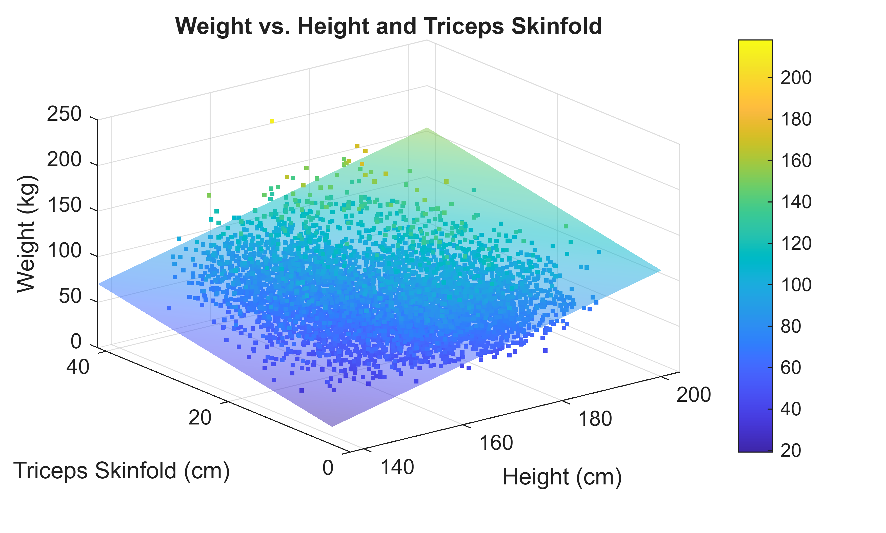
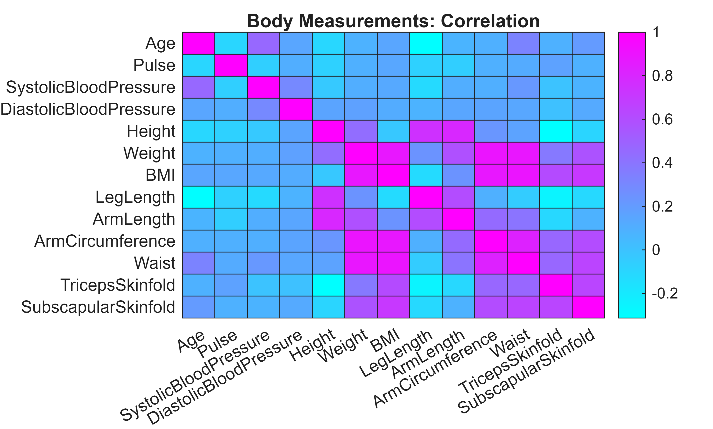
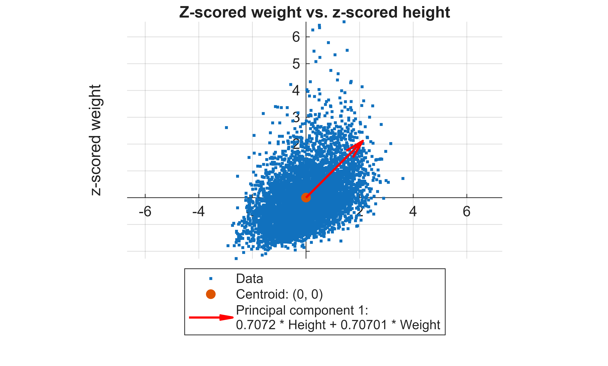
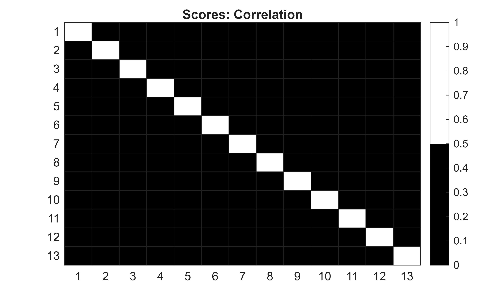
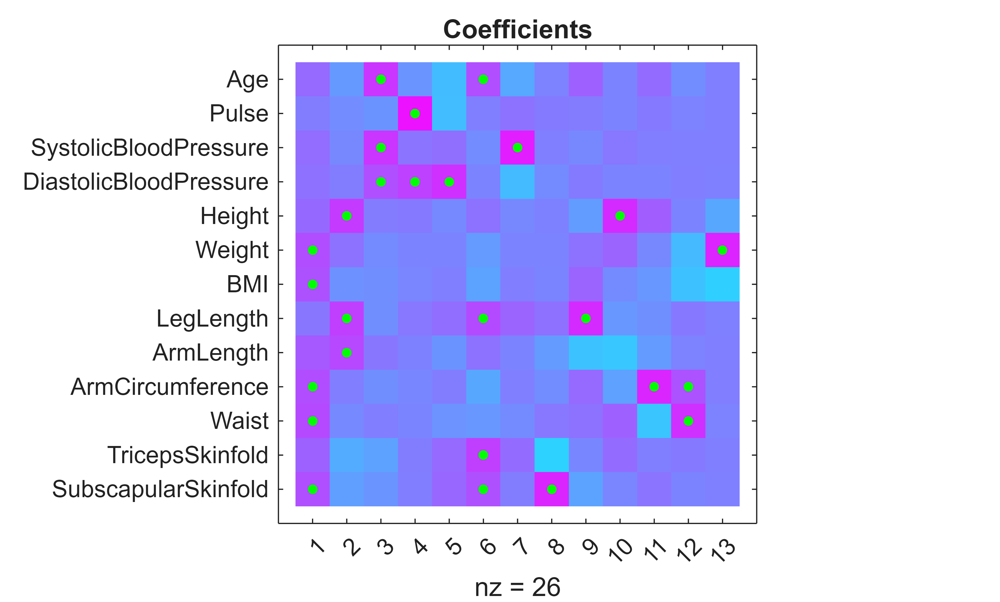
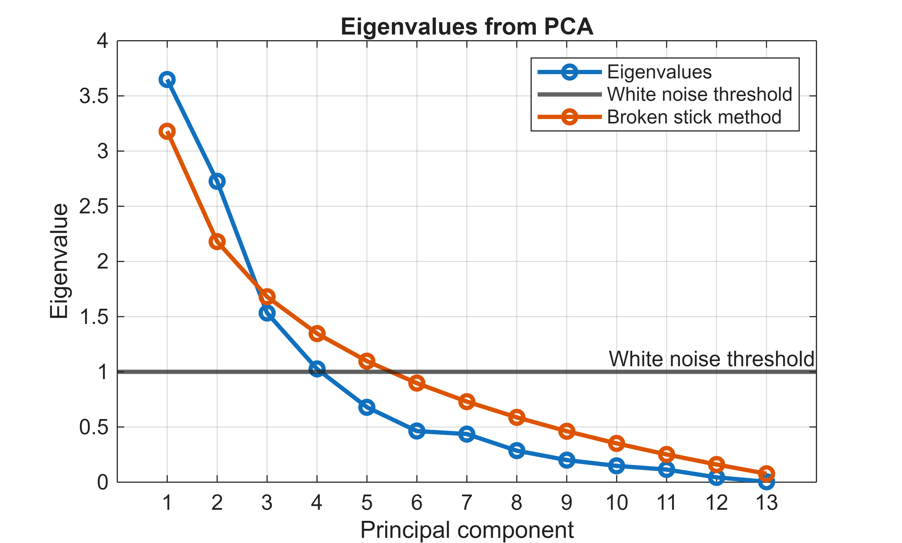
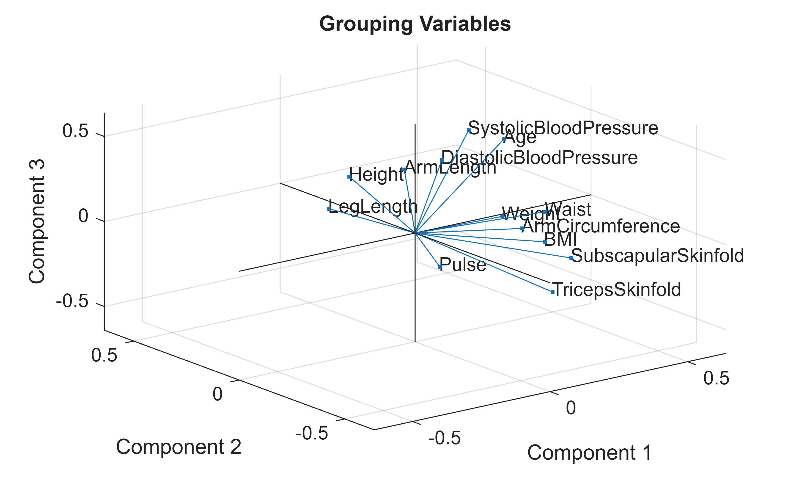

<a id="TMP_14ec"></a>

# **Principal Component Analysis**

In this script we discuss the theory and motivation for principal component analysis (PCA), and walk through the steps involved when applying PCA to a data set.

<!-- Begin Toc -->

## Table of Contents
&emsp;[Context and motivation](#TMP_9c8d)
 
&emsp;&emsp;[Applications](#TMP_112a)
 
&emsp;&emsp;[When can PCA be used?](#TMP_6f3c)
 
&emsp;&emsp;[What is PCA?](#TMP_91f1)
 
&emsp;&emsp;[When should PCA not be used?](#TMP_979e)
 
&emsp;&emsp;[Example data](#TMP_2a76)
 
&emsp;&emsp;[Motivating example](#TMP_8554)
 
&emsp;[Mean and variance](#TMP_46cb)
 
&emsp;&emsp;[Mean](#TMP_687d)
 
&emsp;&emsp;[Examples](#TMP_3985)
 
&emsp;&emsp;[Variance](#TMP_37ff)
 
&emsp;&emsp;[Examples](#TMP_67f3)
 
&emsp;[Covariance and correlation](#TMP_5cc4)
 
&emsp;&emsp;[Covariance](#TMP_33c4)
 
&emsp;&emsp;[Examples](#TMP_884c)
 
&emsp;&emsp;[Correlation](#TMP_649e)
 
&emsp;&emsp;[Example](#TMP_6b3d)
 
&emsp;[Eigenvalues and eigenvectors](#TMP_8a77)
 
&emsp;&emsp;[Interpreting eigenvalues and eigenvectors](#TMP_6466)
 
&emsp;&emsp;[Example](#TMP_31a5)
 
&emsp;&emsp;[Linear independence](#TMP_2924)
 
&emsp;[**Diagonalization of real symmetric matrices**](#TMP_920f)
 
&emsp;&emsp;[**The spectral theorem**](#TMP_8b20)
 
&emsp;&emsp;[Application to covariance/correlation matrices](#TMP_9424)
 
&emsp;&emsp;[Putting everything together](#TMP_41bf)
 
&emsp;[Applying PCA: a geometric interpretation](#TMP_09a9)
 
&emsp;[Translate the data so that the centroid lies at the origin.](#TMP_921a)
 
&emsp;[Rescale the data so that each dimension has standard deviation one.](#TMP_0dbb)
 
&emsp;[Compute the principal components.](#TMP_7d16)
 
&emsp;[Visualize the second principal component.](#TMP_2b7b)
 
&emsp;[Overlay the ellipse with axes defined by the principal components.](#TMP_3a73)
 
&emsp;[Visualize the transformed data in the new coordinate system.](#TMP_2da6)
 
&emsp;[Applying PCA](#TMP_60b4)
 
&emsp;[Interpreting the coefficients, scores, and eigenvalues](#TMP_131f)
 
&emsp;&emsp;[Coefficients](#TMP_50ef)
 
&emsp;&emsp;[Scores](#TMP_24b8)
 
&emsp;&emsp;[Eigenvalues](#TMP_1d57)
 
&emsp;[Deciding how many components to keep](#TMP_429e)
 
&emsp;&emsp;[The elbow method](#TMP_1966)
 
&emsp;&emsp;[The white noise method](#TMP_1bd5)
 
&emsp;&emsp;[The broken stick method](#TMP_9853)
 
&emsp;[Grouping variables](#TMP_2838)
 
&emsp;[Selecting representative features](#TMP_289f)
 
&emsp;[PCA for image feature extraction](#TMP_392c)
 
&emsp;[Outlier analysis](#TMP_3bf5)
 
<!-- End Toc -->
<a id="TMP_9c8d"></a>

# Context and motivation
<a id="TMP_112a"></a>

## Applications

Applications of PCA include:

-  Dimensionality reduction 
-  Understanding how features are related 
-  Identifying groups of similar features (clustering) 
-  Finding outliers 
<a id="TMP_6f3c"></a>

## When can PCA be used?

PCA can be used whenever we have:

-  a collection of continuous numeric variables, or 
-  a correlation or covariance matrix corresponding to a set of variables. 
<a id="TMP_91f1"></a>

## What is PCA?

PCA is a matrix transformation designed to decorrelate a set of variables, represented in a matrix $X$ . The technique involves post\-multiplying $X$ by an orthogonal matrix, $V$ . This results in a set of transformed variables $S$ with the property that the new correlation matrix is diagonal. The transformation matrix is chosen such that the cumulative variance of the new variables is maximized.

-  $X$ \- a numeric matrix of size $n\times p$ , where $n$ is the number of observations (rows) and $p$ is the number of variables (columns) 
-  $V$ \- an orthogonal matrix (i.e., $VV^T =V^T V=I_{p\times p}$ ) of size $p\times p$ 
-  $S$ \- a numeric matrix of size $n\times p$ , obtained by $S=XV$ 
<a id="TMP_979e"></a>

## When should PCA not be used?

PCA is based on linear correlation, so cannot be relied upon to detect nonlinear relationships in data sets.

<a id="TMP_2a76"></a>

## Example data

In this script we work with a processed dataset from the National Health and Nutrition Examination Survey ([NHANES](https://wwwn.cdc.gov/nchs/nhanes/)).


The dataset comprises a set of continuous and categorical variables recording basic body measurements for a collection of individuals.


Each row of the table holds the data for one individual, and each column of the table is a feature or variable.

```matlab
load( "HealthData.mat" )
disp( head( H ) )
```

```matlabTextOutput
             Age    Pulse    SystolicBloodPressure    DiastolicBloodPressure    Height    Weight     BMI     LegLength    ArmLength    ArmCircumference    Waist    TricepsSkinfold    SubscapularSkinfold    MeanArterialPressure    SelfReportedHeight    SelfReportedWeight    BodySurfaceArea
             ___    _____    _____________________    ______________________    ______    ______    _____    _________    _________    ________________    _____    _______________    ___________________    ____________________    __________________    __________________    _______________

    41475    752     66               128                       64              154.7     138.9     58.04      34.2         37.6             45.2          156.3          NaN                  NaN                   85.333                 157.48                139.71              2.2615     
    41477    860     78               144                       60              167.1      83.9     30.05      32.4         38.2             34.1          109.5         15.6                 25.8                       88                 172.72                86.182              1.9303     
    41479    630     62               112                       70              154.4      65.7     27.56      33.3         34.1             33.2           95.4         13.3                 25.9                       84                 170.18                 64.41              1.6429     
    41481    254     52               112                       62              182.7      77.9     23.34      43.6           43               31           79.5          8.4                  9.2                   78.667                 185.42                79.379              1.9954     
    41482    779     76               116                       78              173.8     101.6     33.64      43.5           40             32.8            117           18                 20.1                   90.667                 172.72                103.42              2.1544     
    41483    804     60               110                       62              173.8     133.1     44.06      36.5         38.9             40.5          145.6         17.6                  NaN                       78                 180.34                131.09              2.4165     
    41485    361     68               108                       44              157.9      64.8     25.99      34.3         32.6             30.7           89.7         21.1                 30.5                   65.333                 160.02                62.596                1.66     
    41486    735     62               126                       64              166.2      86.2     31.21        35           36             35.3             97         24.6                 24.8                   84.667                 162.56                84.822               1.945     
```
<a id="TMP_8554"></a>

## Motivating example

Suppose we have a linear regression model:

 $$ \textrm{Weight}=\beta_0 +\beta_1 \textrm{Height}+\beta_2 \textrm{TricepsSkinfold} $$ 
```matlab
load( "HealthData.mat" )
modelVars = H(:, ["Height", "TricepsSkinfold", "Weight"]);
model = fitlm( modelVars, "linear" );
disp( model )
```

```matlabTextOutput
Linear regression model:
    Weight ~ 1 + Height + TricepsSkinfold

Estimated Coefficients:
                       Estimate       SE        tStat     pValue
                       ________    ________    _______    ______

    (Intercept)        -157.92       3.1314    -50.431      0   
    Height              1.2616     0.017782      70.95      0   
    TricepsSkinfold      1.324     0.021209     62.424      0   

Number of observations: 5690, Error degrees of freedom: 5687
Root Mean Squared Error: 12.9
R-squared: 0.546,  Adjusted R-Squared: 0.545
F-statistic vs. constant model: 3.41e+03, p-value = 0
```

Evaluate the model over a grid of $(\textrm{Height},\textrm{TricepsSkinfold})$ points.

```matlab
[mn, mx] = bounds( H.Height );
fineHeight = linspace( mn, mx );
[mn, mx] = bounds( H.TricepsSkinfold );
fineTriceps = linspace( mn, mx );
[HeightGrid, TricepsGrid] = meshgrid( fineHeight, fineTriceps );
WeightGrid = predict( model, [HeightGrid(:), TricepsGrid(:)] );
WeightGrid = reshape( WeightGrid, size( HeightGrid ) );
```

Visualize the data and fitted model.

```matlab
figure
scatter3( H.Height, H.TricepsSkinfold, H.Weight, [], H.Weight, "." )
hold on
surf( HeightGrid, TricepsGrid, WeightGrid, "FaceAlpha", 0.5 )
shading interp
xlabel( "Height (cm)" )
ylabel( "Triceps Skinfold (cm)" )
zlabel( "Weight (kg)" )
title( "Weight vs. Height and Triceps Skinfold" )
colorbar
```



How do we interpret this model? Since the model is determined completely by its coefficients, it is natural to use the values of $\beta_0 ,\beta_1$ , and $\beta_2$ to understand how the model represents the data. In particular:

-  $\beta_1$ represents the change in weight (kg) per unit change in height (cm), 
-  $\beta_2$ represents the change in weight (kg) per unit change in triceps skinfold (cm). 

If the height changes significantly, we would expect the triceps skinfold to change significantly because they are significantly linearly correlated.

```matlab
figure
ax = axes;
scatter( H.Height, H.TricepsSkinfold, "." )
bestFitLine = lsline();
bestFitLine.LineWidth = 2;
bestFitLine.Color = ax.ColorOrder(2, :);
xlabel( "Height (cm)" )
ylabel( "Triceps Skinfold (cm)" )
title( "Triceps Skinfold vs. Height" )
grid on
[rho, corrPValue] = corr( H.Height, H.TricepsSkinfold, "Rows", "pairwise" );
legend( "Observed data", "Correlation = " + rho )
```


<a id="TMP_46cb"></a>

# Mean and variance

PCA is based upon some core statistical concepts, primarily the covariance or correlation matrix corresponding to a collection of features. Let's first define the mean and variance.

<a id="TMP_687d"></a>

## Mean

For a random variable $X$ , the mean (or expected value) of $X$ is $\mathbb{E}(X)=\int_{\mathbb{R}} xf(x)dx$ , where $f$ is the probability density function of $X$ . The mean of $X$ has the same units of measurement as $X$ .

<a id="TMP_3985"></a>


## Examples

If $X$ represents a coin toss, then $\mathbb{E}(X)=1/2$ . If $X$ is uniformly distributed on the interval $[0,1]$ , then $\mathbb{E}(X)=1/2$ .

<a id="TMP_37ff"></a>

## Variance

For a random variable $X$ , the variance is the average squared distance to the mean:

 $$ \textrm{var}(X)=\mathbb{E}((X-\mathbb{E}(X))^2 ) $$ 

This is also equivalent to $\textrm{var}(X)=\mathbb{E}(X^2 )-\mathbb{E}(X)^2$ .


The units of variance are equal to the squared units of measurement of $X$ . For this reason, the standard deviation is often used instead of the variance when reporting the spread of a data set:


 $\textrm{std}(X)=\sqrt{\textrm{var(X)}}$ .

<a id="TMP_67f3"></a>


## Examples

If $X$ represents a coin toss, then $\textrm{var}(X)=1/4$ . If $X\sim \textrm{U}(0,1)$ , then $\textrm{var}(X)=1/12$ .

<a id="TMP_5cc4"></a>

# Covariance and correlation
<a id="TMP_33c4"></a>

## Covariance

For two random variables $X$ and $Y$ , the covariance is $\textrm{cov}(X,Y)=\mathbb{E}((X-\mathbb{E}(X))(Y-\mathbb{E}(Y))$ , which is also equivalent to $\textrm{cov}(X,Y)=\mathbb{E}(XY)-\mathbb{E}(X)\mathbb{E}(Y)$ .


Note that:

-  Covariance can be interpreted as a measure of the dependence between $X$ and $Y$ 
-  If $X$ and $Y$ are independent, then $\textrm{cov}(X,Y)=0$ , so computing $\textrm{cov}(X,Y)$ is only meaningful when $X$ and $Y$ are dependent 
-  The converse is false unless $X,Y$ are also jointly normally distributed 
-  The units of measurement of covariance are given by the product of the units of $X$ and $Y$ 

If $X=[{\mathbf{x}}_1 ,\ldots,{\mathbf{x}}_p ]$ is a matrix containing data variables ${\mathbf{x}}_1 ,\ldots,{\mathbf{x}}_p$ , then $\textrm{cov}(X)$ is the $p\times p$ \-matrix with entries $\textrm{cov}({\mathbf{x}}_i ,{\mathbf{x}}_j )$ .

<a id="TMP_884c"></a>


## Examples

If $X$ is a coin toss and $Y$ is the other side of the coin, then $\textrm{cov}(X,Y)=-1/4$ .


If a stick of length 1 is broken randomly into two pieces of length $X$ and $Y$ , then $\textrm{cov}(X,Y)=-1/12$ .

<a id="TMP_649e"></a>

## Correlation

It's difficult to compare covariance between different pairs of variables. This is partly due to the arbitrary scale that the variables may be measured on, and partly due to different units of measurement. For example, how could we compare \-100 $\textrm{kg}\cdot \textrm{m}$ with 5e4 $\textrm{J}\cdot \textrm{V}$ ?


If $X$ and $Y$ have finite variance, then $|\textrm{cov}(X,Y)|\le \textrm{std}(X)\textrm{std}(Y)$ . (This follows from the Cauchy\-Schwarz inequality.) This bound enables the covariance to be normalized to lie between $-1$ and $+1$ :


 $-1\le \frac{\textrm{cov}(X,Y)}{\textrm{std}(X)\textrm{std}(Y)}\le +1$ .


For two random variables $X$ and $Y$ with finite nonzero variance, the correlation is:


 $\rho (X,Y)=\frac{\textrm{cov}(X,Y)}{\textrm{std}(X)\textrm{std(Y)}}=\frac{\mathbb{E}(XY)-\mathbb{E}(X)\mathbb{E}(Y)}{\textrm{std}(X)\textrm{std}(Y)}$ , i.e., the correlation is the normalized covariance.


If $X=[{\mathbf{x}}_1 ,\ldots,{\mathbf{x}}_p ]$ is a matrix containing data variables ${\mathbf{x}}_1 ,\ldots,{\mathbf{x}}_p$ , then $\rho (X)$ is the $p\times p$ \-matrix with entries $\rho ({\mathbf{x}}_i ,{\mathbf{x}}_j )$ .


Note that if $X$ is an $n\times p$ standardized data matrix (i.e., each column has mean 0 and standard deviation 1), then $\textrm{cov}(X)=\rho (X)$ , with entries given by: 


 $\mathbb{E}({\mathbf{x}}_i {\mathbf{x}}_j )=\frac{1}{n}\sum_{k=1}^n x_{k,i} x_{k,j} =\frac{1}{n}(X^T X)_{i,j}$ .


In this case, $\rho (X)=\frac{1}{n}X^T X$ .

<a id="TMP_6b3d"></a>

## Example

Extract the continuous variables.

```matlab
requiredVars = 1:13;
bodyVars = H{:, requiredVars};
bodyVarNames = H(:, requiredVars).Properties.VariableNames;
```

The variables are recorded using different units of measurement with large differences in scale, so it's good practice to standardize them before applying any machine learning technique.

```matlab
figure
boxchart( bodyVars )
xticklabels(bodyVarNames)
title("Continuous Body Variables")
grid on
```


The $z$ \-score transformation for a variable $X$ is $Z=\frac{X-\mathbb{E}(X)}{\textrm{std}(X)}$ . This ensures that $\mathbb{E}(Z)=0$ and $\textrm{std}(Z)=\textrm{var}(Z)=1$ .

```matlab
bodyVarsZScore = normalize( bodyVars, "zscore" );

figure
boxchart( bodyVarsZScore )
xticklabels( bodyVarNames )
title( "Continuous Body Variables" )
grid on
```


Visualize the correlation matrix.

```matlab
rho = corr( bodyVarsZScore, "Rows", "pairwise" );

figure
heatmap( bodyVarNames, bodyVarNames, rho, "Colormap", cool() )
title( "Body Measurements: Correlation" )
```


<a id="TMP_8a77"></a>

# Eigenvalues and eigenvectors
<a id="TMP_6466"></a>

## Interpreting eigenvalues and eigenvectors

If $A\mathbf{v}=\lambda \mathbf{v}$ , then $\mathbf{v}$ represents the direction vector of an invariant line under the transformation defined by $A$ , and $\lambda$ is the scale factor.

<a id="TMP_31a5"></a>

## Example

If $A=\left\lbrack \begin{array}{cc} 2 & 0\newline 0 & 3 \end{array}\right\rbrack$ , then the eigenvalues of $A$ are 2 and 3, with corresponding eigenvectors $[1,0]^T$ and $[0,1]^T$ . The unit square is mapped to the rectangle with coordinates $(2,0),(2,3),(0,3)$ and $(0,0)$ . The volume factor is $2\times 3=6$ .

<a id="TMP_2924"></a>

## Linear independence

If $A$ has eigenvectors ${\mathbf{v}}_1 ,\ldots,{\mathbf{v}}_p$ corresponding to eigenvalues $\lambda_1 ,\ldots,\lambda_p$ , write $V=[{\mathbf{v}}_1 ,\ldots,{\mathbf{v}}_p ]$ . Then:


 $AV=A[{\mathbf{v}}_1 ,\ldots,{\mathbf{v}}_p ]=[A{\mathbf{v}}_1 ,\ldots,A{\mathbf{v}}_p ]=[\lambda_1 {\mathbf{v}}_1 ,\ldots,\lambda {\mathbf{v}}_p ]=V\Lambda$ , where $\Lambda$ is the diagonal matrix containing the eigenvalues of $A$ .


If the eigenvectors are linearly independent, then $V^{-1}$ exists and $V^{-1} AV=\Lambda$ . $A$ is said to be diagonalizable and this means that up to a change of basis, $A$ is equivalent to a diagonal matrix.

<a id="TMP_920f"></a>

# **Diagonalization of real symmetric matrices**
<a id="TMP_8b20"></a>

## **The spectral theorem**

If $A$ is real and $A=A^T$ (or complex and ${\overline{A} }^T =A$ ) then all eigenvalues of $A$ are real and $A$ is diagonalizable. Further, all eigenvectors of $A$ are orthogonal, so the matrix $V$ can be chosen to be orthogonal: $V^T =V^{-1}$ . We have $V^T AV=\Lambda$ .

<a id="TMP_9424"></a>

## Application to covariance/correlation matrices

Any correlation matrix is symmetric, so the spectral theorem applies and we can diagonalize the correlation matrix via an orthogonal matrix. Correlation matrices are also positive definite, i.e., ${\mathbf{v}}^T \rho (X)\mathbf{v}\ge 0$ for all real vectors $\mathbf{v}$ , which implies that their eigenvalues are all nonnegative.

<a id="TMP_41bf"></a>

## Putting everything together

We saw above that for our standardized data matrix $X$ , $\rho (X)=\frac{1}{n}X^T X$ . Applying the spectral theorem we obtain:


 $V^T \rho (X)V=\frac{1}{n}V^T X^T XV=\frac{1}{n}(XV)^T XV=\textrm{cov}(XV)=\Lambda$ .


The columns of the matrix $XV$ are therefore uncorrelated. Also, we can choose the eigenvalues in decreasing order $\lambda_1 \ge \cdots \ge \lambda_p \ge 0$ , so the columns are ordered by their information (variance) content.

<a id="TMP_09a9"></a>

# Applying PCA: a geometric interpretation

In this section, we'll work through an example of applying PCA in two dimensions. This should help to provide a geometric interpretation of the algorithm.


Create a scatter plot of height and weight.

```matlab
figure
scatter( H.Height, H.Weight, "." )
xlabel( "Height (cm)" )
ylabel( "Weight (kg)" )
title( "Weight vs. height" )
grid on
```

Plot the centroid (mean $x$ and $y$ values) of the data cloud.

```matlab
c = mean( H{:, ["Height", "Weight"]}, "omitmissing" );
hold on
plot( c(1), c(2), ".", "MarkerSize", 20 )
legend( "Data", "Centroid: (" + num2str( c(1), "%.2f" ) + "cm, " + num2str( c(2), "%.2f" ) + "kg)", "Location", "northwest" )
axis equal
```


<a id="TMP_921a"></a>

# Translate the data so that the centroid lies at the origin.

We subtract the mean value of each variable. This creates new data centered at the origin.

```matlab
centeredHeight = H.Height - c(1);
centeredWeight = H.Weight - c(2);
```

Recreate the scatter graph.

```matlab
figure
ax = axes();
scatter( centeredHeight, centeredWeight, "." )
xlabel( "Mean-centered height (cm)" )
ylabel( "Mean-centered weight (kg)" )
title( "Weight vs. height" )
grid on
```

Plot the new centroid.

```matlab
c = mean( [centeredHeight, centeredWeight], "omitmissing" );
hold on
plot( c(1), c(2), ".", "MarkerSize", 20 )
legend( "Data", "Centroid: (0, 0)", "Location", "northwest" )
axis equal
ax.XAxisLocation = "origin";
ax.YAxisLocation = "origin";
```


<a id="TMP_0dbb"></a>

# Rescale the data so that each dimension has standard deviation one.

We divide the centered data by the standard deviation of each variable. This creates new data with standard deviation (and variance) one in each dimension.

```matlab
zscoredHeight = centeredHeight / std( H.Height, "omitmissing" );
zscoredWeight = centeredWeight / std( H.Weight, "omitmissing" );
```

Recreate the scatter graph.

```matlab
figure
ax = axes();
scatter( zscoredHeight, zscoredWeight, "." )
xlabel( "z-scored height" )
ylabel( "z-scored weight" )
title( "Z-scored weight vs. z-scored height" )
grid on
hold on
plot( c(1), c(2), ".", "MarkerSize", 20 )
legend( "Data", "Centroid: (0, 0)", "Location", "northwest" )
axis equal
ax.XAxisLocation = "origin";
ax.YAxisLocation = "origin";
```


<a id="TMP_7d16"></a>

# Compute the principal components.

Note that rows containing missing values are removed by default.

```matlab
[V, S] = pca( [zscoredHeight, zscoredWeight] );
```

Extract column vectors corresponding to the two principal component coefficients.

```matlab
pc1 = V(:, 1);
pc2 = V(:, 2);
```

Visualize the first principal component. First, recreate the scatter graph and centroid.

```matlab
figure
ax = axes();
scatter( zscoredHeight, zscoredWeight, "." )
xlabel( "z-scored height" )
ylabel( "z-scored weight" )
title( "Z-scored weight vs. z-scored height" )
grid on
hold on
plot( c(1), c(2), ".", "MarkerSize", 20 )
```

Next, format the equation of the first principal component in terms of the variables.

```matlab
if pc1(2) >= 0
    s = " + " + num2str( pc1(2) );
else
    s = " - " + num2str( -pc1(2) );
end % if
comp1Eqn = num2str( pc1(1) ) + " * Height" + s + " * Weight";
```

Add a quiver arrow to represent the principal component vector.

```matlab
scale = 3;
quiver( c(1), c(2), pc1(1), pc1(2), scale, ...
    "LineWidth", 1.5, "Color", "r", "MaxHeadSize", 1 )
axis equal
legend( "Data", "Centroid: (0, 0)", ...
    "Principal component 1: " + newline() + comp1Eqn, ...
    "Location", "southoutside" )
ax.XAxisLocation = "origin";
ax.YAxisLocation = "origin";
```


<a id="TMP_2b7b"></a>

# Visualize the second principal component.

Format the equation of the second principal component.

```matlab
if pc2(2) >= 0
    s = " + " +  num2str( pc2(2) );
else
    s = " - " + num2str( -pc2(2) );
end % if
comp2Eqn = num2str( pc2(1) ) + " * Height " + s + " * Weight";
quiver( c(1), c(2), pc2(1), pc2(2), scale, ...
    "LineWidth", 1.5, "Color", "r", "MaxHeadSize", 1, ...
    "DisplayName", "Principal component 2: " + newline() + comp2Eqn )
```


In this example, the coefficient matrix is $V=\frac{1}{\sqrt{2}}\left\lbrack \begin{array}{cc} 1 & -1\newline 1 & 1 \end{array}\right\rbrack =\left\lbrack \begin{array}{cc} \cos (\pi /4) & -\sin (\pi /4)\newline \cos (\pi /4) & \sin (\pi /4) \end{array}\right\rbrack$ .


The matrix $V$ represents an anticlockwise rotation of $\pi /4$ radians (45 degrees) about the positive $x$ \-axis.

<a id="TMP_3a73"></a>

# Overlay the ellipse with axes defined by the principal components.

The equation of an ellipse centered at the origin is ${\left(\frac{x}{a}\right)}^2 +{\left(\frac{y}{b}\right)}^2 =1$ , where $a,b>0$ are constants. We can write the ellipse in parametric coordinates as $x=a\cos t$ , $y=b\sin t$ . The equation defining the principal component analysis is $S=XV$ . To reconstruct the data $X$ we therefore obtain $X=SV^T$ .

```matlab
t = linspace( 0, 2 * pi, 500 ).';
x = scale * cos(t);
y = scale * sin(t);
e = [x, y] * V.';
xellipse = e(:, 1);
yellipse = e(:, 2);
plot( xellipse, yellipse, ":", "LineWidth", 2, "DisplayName", "Ellipse with principal component axes" )
```


<a id="TMP_2da6"></a>

# Visualize the transformed data in the new coordinate system.

Plot the transformed data points (the scores) and the centroid.

```matlab
figure
ax = axes();
scatter( S(:, 1), S(:, 2), ".", "DisplayName", "Transformed height/weight data" )
hold on
plot( c(1), c(2), ".", "MarkerSize", 20, "DisplayName", "Centroid: (0,0)" )
```

Annotate the chart and draw the axes to pass through the origin.

```matlab
ax.XAxisLocation = "origin";
ax.YAxisLocation = "origin";
xlabel( "Component 1" )
ylabel( "Component 2" )
title( "Data points in the transformed coordinates" )
grid on
```

Overlay the component vectors.

```matlab
quiver( c(1), c(2), 1, 0, scale, ...
    "LineWidth", 2, "Color", "r", "MaxHeadSize", 1, ...
    "DisplayName", "Principal component 1" )
quiver( c(1), c(2), 0, 1, scale, ...
    "LineWidth", 2, "Color", "r", "MaxHeadSize", 1, ...
    "DisplayName", "Principal component 2" )
axis equal
```

Visualize the ellipse with axes defined by the principal component vectors. 

```matlab
plot( x, y, ":", "LineWidth", 2, "DisplayName", "Ellipse with principal component axes" )
legend( "Location", "southoutside" )
```


<a id="TMP_60b4"></a>

# Applying PCA

Now that we've applied PCA in two dimensions and interpreted the results geometrically, let's scale up to the entire data set.

```matlab
[V, S, Lambda] = pca( bodyVarsZScore, "Rows", "pairwise" );
```

Verify that the transformed variables are uncorrelated.

```matlab
srho = corr( S, "Rows", "pairwise" );

figure
heatmap( srho, "Colormap", turbo() )
title( "Scores: Correlation" )
```


<a id="TMP_131f"></a>

# Interpreting the coefficients, scores, and eigenvalues
<a id="TMP_50ef"></a>

## Coefficients

The transformation matrix $V$ is often referred to as the coefficient matrix, or loadings matrix. Each column represents a principal component, and each row represents a variable from the original data matrix. The elements of the matrix are weights corresponding to the contribution of each variable to the principal component.


In other words, ${\textrm{PC}}_k =\sum_{i=1}^p V_{i,k} {\mathbf{x}}_i$ for each $k\in \lbrace 1,\ldots,p\rbrace$ , where $X=[{\mathbf{x}}_1 ,\ldots,{\mathbf{x}}_p ]$ is the original data matrix.

```matlab
p = width( bodyVars );

figure
imagesc( 1:p, 1:p, V, [-1, 1] )
colormap cool
xticks( 1:p )
xlabel( "Principal component" )
yticks( 1:p )
yticklabels( bodyVarNames )
title( "Coefficients" )
```

Visualize variables which have a high association with each principal component.

```matlab
highIdx = V > 0.30;
hold on
spy( highIdx, "g.", 12 )
```



We see that:

-  Component 1 represents weight\-related variables 
-  Component 2 represents height\-related variables 
-  Component 3 represents age and blood pressure\-related variables 
-  Component 4 is closely related to pulse 
-  Subsequent components don't contribute much more information 
<a id="TMP_24b8"></a>

## Scores

The scores are the transformed variables, $S=XV$ . These are uncorrelated by construction. The total variance of the scores is equal to the total variance of the original data. (This is because the trace of a matrix is preserved under a similarity transform.) Each score is a linear combination of all the original variables in $X$ , with the weights in the linear combination given by the corresponding column of the transformation matrix $V$ .


Visualize the scores using the first three principal components. Show the positions of the original vectors in the new coordinate system.

```matlab
figure
biplot( V(:, 1:3), "Scores", S(:, 1:3), "VarLabels", bodyVarNames )
title( "Scores and Variables" )
```


<a id="TMP_1d57"></a>

## Eigenvalues

The eigenvalues represent the relative proportions of the total variance explained by each principal component.

```matlab
figure
plot( Lambda, "o-", "LineWidth", 2 )
xticks( 1:p )
xlabel( "Principal component" )
ylabel( "Eigenvalue" )
title( "Eigenvalues from PCA" )
grid on
```


Show the same information as a cumulative percentage of the total variance.

```matlab
figure
pareto( Lambda )
xlabel( "Principal component" )
ylabel( "Eigenvalue" )
title( "Pareto Plot for the Health Data PCA" )
grid on
```


<a id="TMP_429e"></a>

# Deciding how many components to keep
<a id="TMP_1966"></a>

## The elbow method

In this method, we look for an elbow (a point at which the gradient changes rapidly) in the eigenvalue plot. For this data set, we could choose to keep 4 components.

<a id="TMP_1bd5"></a>

## The white noise method

With this approach, we take only those principal components which contain more information than what we'd obtain from applying the same algorithm to a data set comprised of white noise (i.e., data sampled from the standard normal distribution $N(0,1)$ . Since we standardized our data and worked from the correlation matrix, this is equivalent to keeping those principal components with a variance above 1.

```matlab
figure
plot( Lambda, "o-", "LineWidth", 2 )
xticks( 1:p )
xlabel( "Principal component" )
ylabel( "Eigenvalue" )
title( "Eigenvalues from PCA" )
grid on
yline( 1, "LineWidth", 2, "Label", "White noise threshold" )
```
<a id="TMP_9853"></a>

## The broken stick method

If a stick of length 1 is broken randomly into $p$ segments of lengths $L_1 \ge L_2 \ge \cdots \ge L_p$ , then

 $$ \mathbb{E}(L_k )=\frac{1}{p}\sum_{i=k}^p \frac{1}{i} $$ 

For example, the expected length of the longest segment is $\mathbb{E}(L_1 )=\frac{1}{p}\left(1+1/2+1/3+\ldots+1/p\right)$ , and for the next longest is $\mathbb{E}(L_2 )=\frac{1}{p}\left(1/2+\ldots+1/p\right)$ .


We can choose to keep those principal components $V_k$ with variance greater than $\mathbb{E}(L_k )$ . These components account for more variance than what would be expected by chance.

```matlab
reciprocals = 1 ./ (1:p);
expectedLengths = sum( reciprocals ) - cumsum( [0, reciprocals(1:end-1)] );
hold on
plot( expectedLengths, "o-", "LineWidth", 2 )
legend( "Eigenvalues", "White noise threshold", "Broken stick method" )
```



Following the broken stick method, we would keep two components.

<a id="TMP_2838"></a>

# Grouping variables

Let's look at the positions of the variables within the new coordinate system.

```matlab
figure
biplot( V(:, 1:3), "VarLabels", bodyVarNames )
title( "Grouping Variables" )
```



Observations:

-  There are three main groups, or clusters, of variables, corresponding to the principal components we identified above 
-  Orthogonal vectors are uncorrelated 
-  Parallel vectors are correlated 
-  Long vectors are well\-represented in the given coordinates 
-  Short vectors are not well\-represented in the given coordinates (e.g., pulse) 
<a id="TMP_289f"></a>

# Selecting representative features

If our objective is to select features for a model, we may want to work with observed data rather than principal components. This could be for ease of interpretation \- it's easier to understand a variable such as height or weight, but principal components cannot be observed directly \- they are linear combinations of features and so exist only in an abstract sense. We might also want to select a representative feature from each of the groups of features that we've previously identified.


We can perform another orthogonal transformation to maximize the correlation between the principal component axes and the original variables.

```matlab
A = rotatefactors( V );

figure
heatmap( 1:p, bodyVarNames, abs(A), "Colormap", cool() )
title( "After Factor Rotation" )
```


The disadvantage of this approach is that by selecting original variables instead of principal components, we reintroduce mutual correlation. Unless the selected variables are already uncorrelated, they will not explain as much variance as selecting the same number of principal components.

<a id="TMP_392c"></a>

# PCA for image feature extraction

Since $S=XV$ , we have $X=SV^T$ . The original data matrix is therefore approximated by $X\approx S_n V_n^T$ , where $S_n$ is the matrix comprising the first $n$ columns of $S$ (and similarly for $V_n$ ).


Select an image file and convert it to a grayscale floating\-point matrix.

```matlab
imageFile = "peppers.png";
rgb = imread( imageFile );
gray = im2gray( rgb );
I = double( gray );
```

Apply PCA. Do not center the data \- this makes the reconstruction simpler. We don't standardize the image data because we expect all elements belong to a fixed grayscale range of integer values.

```matlab
[IV, IS, ILambda] = pca( I, "Centered", false );
numComponents = 13;
```

Approximate the grayscale image.

```matlab
approxI = IS(:, 1:numComponents) * IV(:, 1:numComponents).';
```

Show the results.

```matlab
figure
imshowpair( gray, approxI, "montage" )
title( "Number of components: " + numComponents )
```


<a id="TMP_3bf5"></a>

# Outlier analysis

Each row of the scores matrix corresponds to an observation in the new coordinate system. We can use the distance to the origin in the new coordinates, weighted by the variance of each principal component, to measure how unusual each data point is. These values are referred to as Hotelling's $t^2$ \-statistics, and are available as the fourth output from the `pca` function.


Alternatively, we can compute them directly from the scores and eigenvalues as follows.

```matlab
t2 = sum( (S ./ Lambda.').^2, 2 );
```

The vector $\Lambda$ containing the eigenvalues is equivalent to a vector containing the variance of each column of the scores.


We'll learn more about identifying outliers using the $t^2$ \-statistics in another session.

