# Outliers Analysis

This script explores different outlier (or novelty) detection methods on the unlabeled Air quality data [https://archive.ics.uci.edu/dataset/360/air+quality.](https://archive.ics.uci.edu/dataset/360/air+quality.)

<a name="beginToc"></a>

## Table of Contents
&emsp;[Context and motivation](#context-and-motivation)
 
&emsp;[Import data](#import-data)
 
&emsp;[Identifying outliers in a single variable](#identifying-outliers-in-a-single-variable)
 
&emsp;[Correlations](#correlations)
 
&emsp;[PCA](#pca)
 
&emsp;[Multivariate outlier detection methods](#multivariate-outlier-detection-methods)
 
&emsp;&emsp;[T\-squared statistic method](#t-squared-statistic-method)
 
&emsp;&emsp;[t\-SNE](#t-sne)
 
&emsp;&emsp;[Mahalanobis distance](#mahalanobis-distance)
 
&emsp;&emsp;[Robust multivariate covariance method](#robust-multivariate-covariance-method)
 
&emsp;&emsp;[DBSCAN method](#dbscan-method)
 
&emsp;&emsp;[Model\-based methods](#model-based-methods)
 
&emsp;&emsp;&emsp;[Local Outlier Factor](#local-outlier-factor)
 
&emsp;&emsp;&emsp;[Isolation Forest](#isolation-forest)
 
&emsp;&emsp;&emsp;[**Robust Random Cut Forest**](#-textbf-robust-random-cut-forest-)
 
&emsp;&emsp;&emsp;[One\-class SVM](#one-class-svm)
 
&emsp;&emsp;&emsp;[Autoencoder](#autoencoder)
 
&emsp;[Combine all the methods](#combine-all-the-methods)
 
<a name="endToc"></a>

# Context and motivation

**What are outliers? What are novelties?**


Outliers (or anomaly) are observations that deviate significantly from a dataset's normal behavior. Outliers can mean unwanted data or events of interest (or *novelty*).


**Outlier detection vs novelty detection:**

-  Outlier detection looks for "abnormal" outliers within the known data \->  known data already contains outliers 
-  Novelty detection aims to identify new data points that deviate from the known pattern \-> known data is assumed to be outlier\-free 

**Outlier types:** point outliers, segment outliers, time series outliers.


**Applications:**

-  Outlier detection: fraud detection, system monitoring, and quality control 
-  Novelty detection: discovering emerging trends, new customer behaviors, or identifying potential new market 


**How to find outliers?**

-  Visual inspection and statistical methods: scatter plot, histogram, boxplot etc. 
-  Multivariate distance\-based methods: $t^2$ statistic distance method, multivariate covariance method 
-  Density based methods: DBSCAN 
-  Model\-based methods:  Local Outlier Factor, Isolation Forest, Robust Random Cut Fores, One\-class SVM. 
-  Deep learning methods: Auto Encoder 


**Download the data if needed.**

```matlab
downloadData = exist(fullfile("Data","AirQualityUCI.xlsx"), "file") ~= 2;
if downloadData
    url = "https://archive.ics.uci.edu/static/public/360/air+quality.zip";
    websave(fullfile("Data","AirQuality.zip"), url)
    unzip(fullfile("Data","AirQuality.zip"), "Data")
end
```

# Import data

Read in as timetable and preprocess before outlier detection.

```matlab
dataTT = readtimetable("AirQualityUCI.xlsx", "VariableNamingRule","preserve");
```

Datetime manipulation.

```matlab
dataTT.Properties.RowTimes = dataTT.Properties.RowTimes+dataTT.Time;
dataTT.Time =[];
```

Standardize the missing because the original data uses \-200 to indicate missing entries.

```matlab
dataTT= standardizeMissing(dataTT,-200);
```

90% of the data in the NMHC(GT) variable is missing, so we exclude this column first.

```matlab
dataTT.("NMHC(GT)")=[];
```

Remove the rest missing entries.

```matlab
dataTT= rmmissing(dataTT);
```

Stacked plot the data

```matlab
figure
stackedplot(dataTT)
```


Extract and normalize the features data in matrix form for the following machine learning algorithms.

```matlab
data = dataTT.Variables;
dataNorm = normalize(data);
```

# Identifying outliers in a single variable

Take O3 as an example. We first exam if the data normally distributed before choosing the outlier detection methods.

```matlab
ozone = dataTT.("PT08.S5(O3)");
figure
tiledlayout("flow")
nexttile
histogram(ozone, "NumBins",50)
title("Ozone Histogram( mean: "+ round(mean(ozone), 2)+", std:"+round(std(ozone), 2)+")")
nexttile
boxchart(ozone, "Orientation","horizontal", "JitterOutliers","on")
yticklabels("Ozone")
```


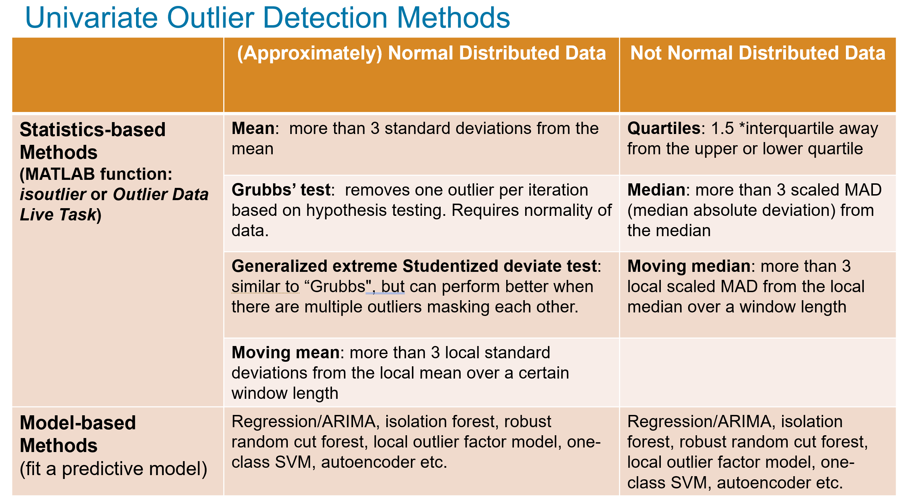


Try out a few appropriate outlier detection methods for this variable e.g., quantile, moving median, isolation forest etc.

```matlab
% Quantile method
quantileOutlierIdx = isoutlier(ozone,"quartiles");
% Moving median method
moveMedianOutlierIdx = isoutlier(ozone,"movmedian",9);
% Iforest method
[mdl, iforestOutlierIdx] = iforest(ozone, "ContaminationFraction",0.03);
figure
% Plot the original data.
plot(dataTT.Properties.RowTimes, ozone, "Color",[0.5, 0.5, 0.5])
hold on
% Quantile outliers
scatter(dataTT.Properties.RowTimes(quantileOutlierIdx), ozone(quantileOutlierIdx), "MarkerEdgeColor","b", "Marker","x")
% Moving median outliers
scatter(dataTT.Properties.RowTimes(moveMedianOutlierIdx), ozone(moveMedianOutlierIdx), "MarkerEdgeColor","r")
% Iforest outliers
scatter(dataTT.Properties.RowTimes(iforestOutlierIdx), ozone(iforestOutlierIdx), "MarkerEdgeColor","k")
hold off
xlim tight
legend(["Input data","Quantile("+nnz(quantileOutlierIdx)+")", ...
    "Moving median("+nnz(moveMedianOutlierIdx)+")", "Isolation Forest ("+nnz(iforestOutlierIdx)+")"], "Location","best")
```

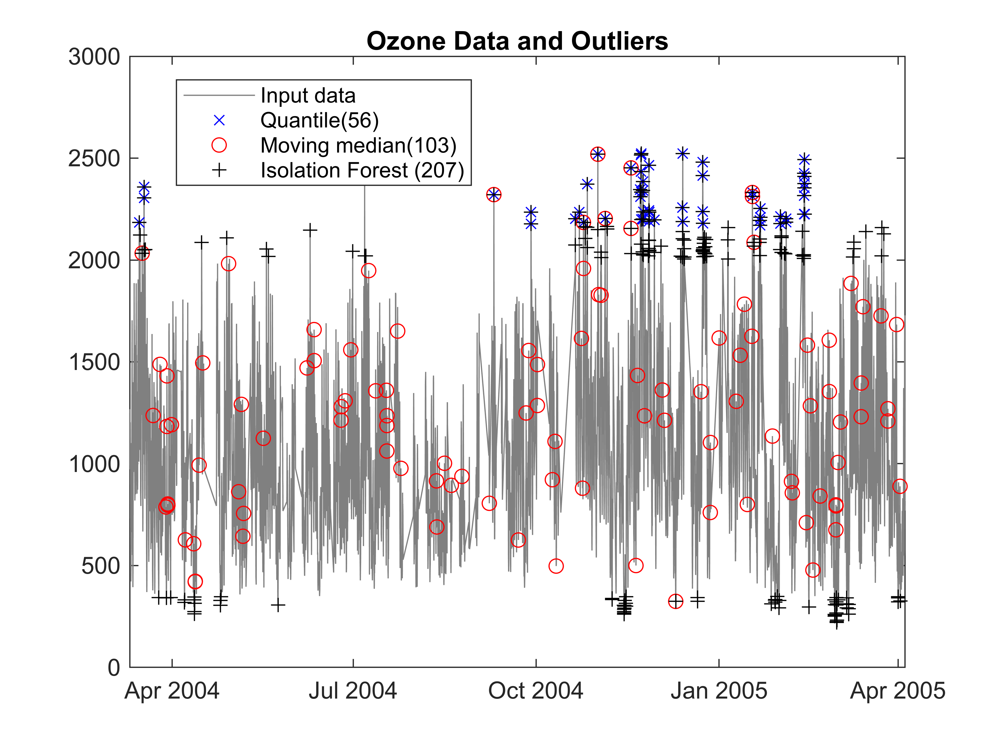

For univarite outlier detection, we can use the Clean Outlier Data Live Task.

# Correlations
```matlab
[rho, pValues] = corr(dataNorm,"Type","Pearson");
featureNames = string(dataTT.Properties.VariableNames);
figure
heatmap(featureNames, featureNames, rho, "Colormap", cool())
title("Data Correlation")
```

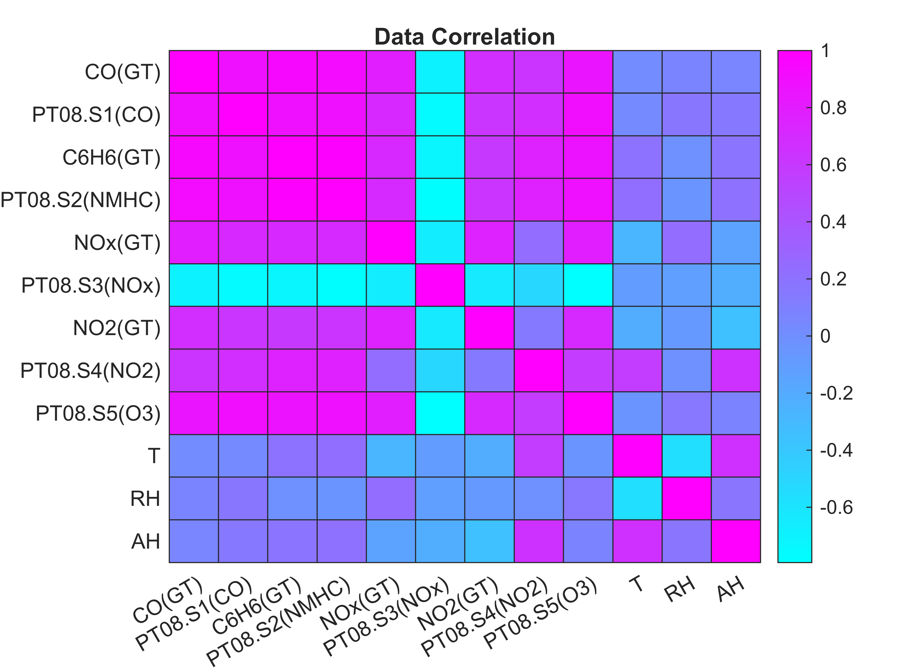

# PCA
```matlab
[C, S, e, t2, explained] = pca(dataNorm);

figure
tiledlayout(1,2)
nexttile
pareto(explained)
xlabel("Principal Component")
nexttile
plot(e, "o-", "LineWidth", 2)
xlabel("Principal Component")
ylabel("Eigenvalue")
```

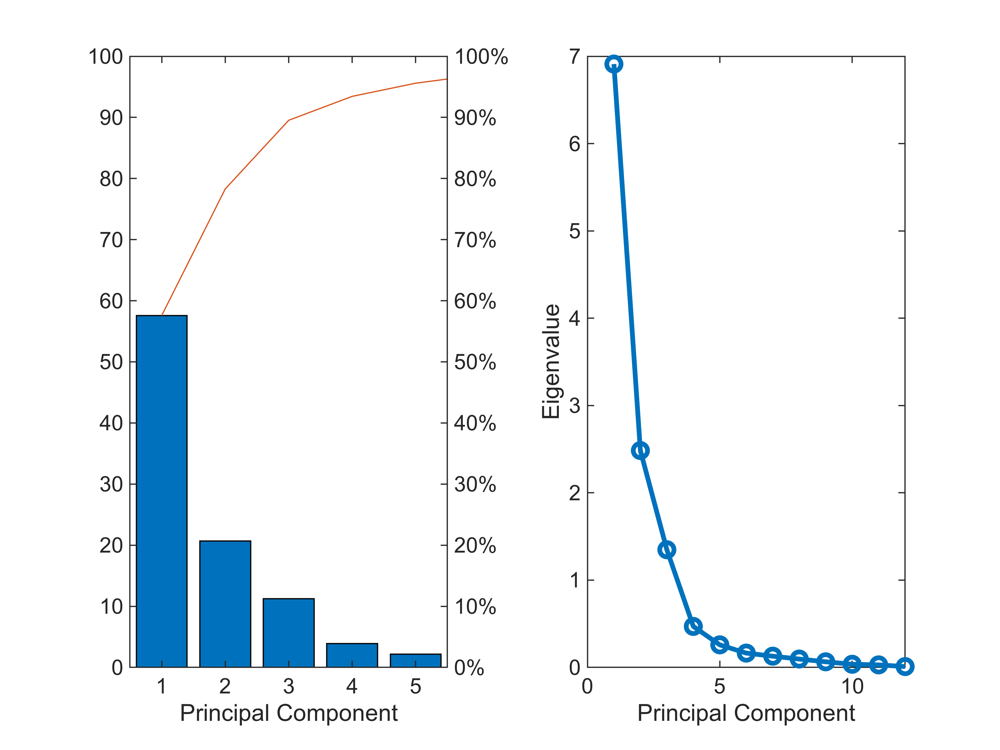

To find the number of components to use, you can use 

-  the elbow method 
-  white noise method 
-  broken stick method 
-  cumulative variance method (i.e., to capture certain amount of variance in the data, how many components do we need?) 
```matlab
varThreshold = 85;
numComponents = find(cumsum(explained)>=varThreshold,1)
```

```matlabTextOutput
numComponents = 3
```

Visualize the scores using the first three principal components. Show the positions of the original vectors in the new coordinate system.

```matlab
figure
biplot( C(:, 1:3), "Scores", S(:, 1:3), "VarLabels",featureNames)
title( "Scores and Variables")
```


To understand which of the original features are important to the reduced PCA components, we can use a post\-hoc rotation provided by [**`rotatefactors`**](matlab: doc rotatefactors).

```matlab
A = rotatefactors(C);
A = round(abs(A));
[~, impIdx] = max(A);
importantFeatures = featureNames(impIdx(1:numComponents))';
disp(importantFeatures)
```

```matlabTextOutput
    "C6H6(GT)"
    "T"
    "RH"
```

-  C6H6(GT): true hourly averaged Benzene concentration in microg/m^3 (reference analyzer). Benzene (C6H6) is considered a precursor to ozone formation, meaning it can chemically react with other pollutants in the atmosphere, particularly in the presence of sunlight, to produce ozone as a secondary pollutant; especially when combined with nitrogen oxides (NOx). Ground\-level ozone is a harmful air pollutant that's closely linked to air quality. It's a major component of smog, and it can damage human health and the environment. 
-  T: temperature ( $^{\circ } C$ ) 
-  RH: relative humidity (%) 

# Multivariate outlier detection methods


## T\-squared statistic method

Hotelling’s $t^2$  statistic is a statistical measure used to assess whether a multivariate observation is significantly different from a group mean. Essentially, Hotelling's $t^2$  statistic is a calculated value based on the squared Mahalanobis distance, incorporating sample size to enable hypothesis testing. 


Set the outlier fraction between 0.01 and 0.05. 

```matlab
contaminationFraction = 0.03;
t2Threshold = quantile(t2, 1-contaminationFraction);
t2OutlierIdx = t2 > t2Threshold;
figure
histogram(t2, "Normalization","cdf", "FaceAlpha",0.1, "EdgeAlpha",0.4)
hold on
yline(1-contaminationFraction, "Label","Cumulative probability="+(1-contaminationFraction), ...
    "Color","r","LineWidth",2,"LabelHorizontalAlignment","left","LabelColor","m", "LabelVerticalAlignment","bottom")
xline(t2Threshold, "Color","r", "Label","Threshold value="+round(t2Threshold,2),"LabelColor","m","LineWidth",2, "LabelVerticalAlignment","bottom")
title("t2 Emperical CDF")
```

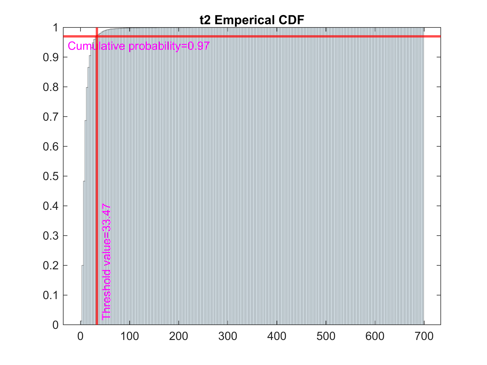

Confirm it is a reasonable outlier fraction by visualizing the sorted  $t^2$ values.

```matlab
figure
plot((1:length(t2))/length(t2), sort(t2, "descend"))
xlabel("Percentage of data")
ylabel("t^2-statistic")
xline(contaminationFraction, "Label", "Outlier fraction = "+contaminationFraction)
title("t^2-statistic Outlier fraction")
```


Visualize in the first three principal components and highlight the outliers.

```matlab
visualizeOutliersinPCA(S,t2OutlierIdx);
```


Tabulate the outliers, and display the results.

```matlab
outliersTT = dataTT;
outliersTT.T2Outlier = t2OutlierIdx;
```

This  $t^2$ statistics method is based on PCA, since PCA only use linear correlation of features, if features have non\-linear correlations, such nonlinear relationship is hard to be picked up by PCA.

## t\-SNE

tSNE (*t*\-distributed Stochastic Neighbor Embedding) constructs a set of embedded points in a low\-dimensional space (Y, Student *t* distribution) whose relative similarities mimic those of the original high\-dimensional points (X).


Assumption: distant (or nearby) points in high\-dimensional space correspond to distant (or nearby) embedded low\-dimensional points. (Generally, it is impossible to match distances exactly between high\-dimensional and low\-dimensional spaces.)


How: minimize the Kullback\-Leibler divergence between a Gaussian distribution in the high\-dimensional space (X) and a *t* distribution in the low\-dimensional space (Y).


Steps:

1.  Remove rows with NaN. Standardize data, use a given number of principal components (recommended).
2. Calculate the pairwise distances (Euclidean metric by default) between the high\-dimensional points $d(x_i ,x_j )$ .
3. Estimate a Gaussian distribution for each $x_i$ and the conditional probability of $P_{j|i}$ (ie. prob. of $x_i$ would pick $x_j$ as its neighbor if neighbors were picked in proportion to their probability density under a Gaussian centered at $x_i$ ).  $P_{j|i} =\frac{exp(-d(x_i ,x_j )^2 )/(2\sigma_i^2 )}{\sum_{k\not= i} exp(-d(x_i ,x_k )^2 )/(2\sigma_i^2 )}$ The joint probability $P_{ij} =\frac{P_{j|i} +P_{j|i} }{2N}$ . $P_i$ represents the conditional probability distribution over all other data points given data point $x_i$ . The Shannon entropy of $P_i$ ,  $H(P_i )=-\sum_j P_{j|i} \log_2 (P_{j|i} )$ .
4. Initialize a set of random Gaussian\-distributed points Y.`tsne` then calculates the similarities between each pair of points in Y. The probability model $q_{ij}$ of the distribution of the distances between points $y_i$ and $y_j$ is $q_{ij} =\frac{(1+\|y_i -y_j {\|}^2 )^{-1} }{\sum_k \sum_{l\not= k} (1+\|y_k -y_l {\|}^2 )^{-1} }$ . The Kullback\-Leibler divergence between the joint distribution *P* and *Q* is $KL(P\|Q)=\sum_j \sum_{i\not= j} p_{ij} log\frac{p_{ij} }{q_i j}$
```matlab
rng default
[tsneEmbeddings, loss] = tsne(data,"NumDimensions",3, "NumPCAComponents",numComponents,"Standardize",true, "Distance","mahalanobis");
```

## Mahalanobis distance

[Mahalanobis distance](https://en.wikipedia.org/wiki/Mahalanobis_distance) measures the distance between a point *x* and the center of a multivariate distribution $Q$ :  how many standard deviations away x is from the mean of $Q$ . This distance is zero for *x* at the mean of $Q$ and grows as *x* moves away from the mean along each principal component axis. By default, the data is assumed to follow a multivariate normal distribution. Differs from Euclidean distance which treats all dimensions equally; Mahalanobis distance scales distances based on the variability and correlations in the data.


Given a probability distribution $Q$ , with mean $\mu$ and positive semi\-definite covariance matrix $\sum$ , the Mahalanobis distance $d_M (X)=\sqrt{(X-\mu )\cdot \sum^{-1} \cdot (X-\mu )^T }$ . 

```matlab
figure
ax = axes;
scatter3(tsneEmbeddings(:,1), tsneEmbeddings(:, 2), tsneEmbeddings(:,3), ...
    "filled", "MarkerFaceColor",[ 0.0620,0.50,0.5010], "MarkerFaceAlpha",0.8)
hold on
m = mean(tsneEmbeddings);
M = cov(tsneEmbeddings);
sigmaNum = 5;% Number of standard deviation from the center.
f = @(x,y,z)([x,y,z]-m)*inv(M)*([x;y;z]-m')-sigmaNum; %#ok<MINV> 
f1 = @(x,y,z) arrayfun(f,x,y,z);
h = fimplicit3(f1,axis(gca));
h.EdgeColor = "none";
h.FaceColor = [1.0000, 0.8190, 0.6190];
h.FaceAlpha = 0.5;
hold off
xlabel("tsneEmbeddingsX")
ylabel("tsneEmbeddingsY")
zlabel("tsneEmbeddingsZ")
title("Air Quality Data in 3D tSNE Representation")
```

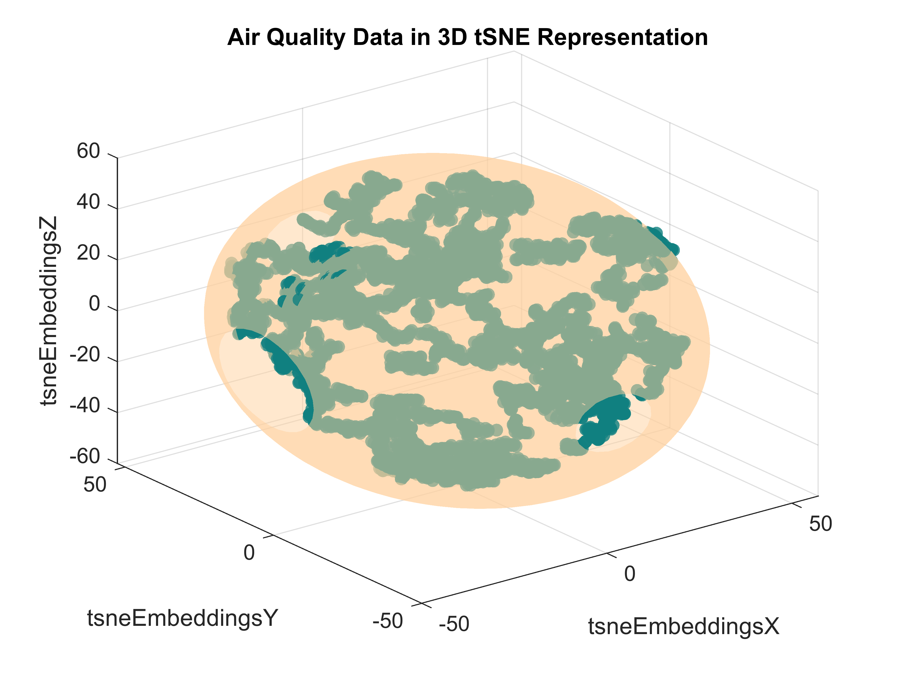

Euclidean Distance Vs Mahalanobis Distance :

-  Mahalanobis distance can be thought of as a generalized form of Euclidean distance i.e., when the covariance matrix is an identity matrix. 
-  Euclidean distance treats all dimensions equally; Mahalanobis distance scales distances based on the variability and correlations in the data. 
-  Euclidean distance is suitable for simple, uncorrelated data, while Mahalanobis distance is preferred for multivariate data where correlations between variables are significant. 

## Robust multivariate covariance method

Use the [`robustcov`](http://127.0.0.1:62846/static/help/stats/robustcov.html) function to compute robust Mahalanobis distances and robust estimates for the mean and covariance of the data, which are less sensitive to outliers than the estimates from the `cov` and `mean` functions. By default, the function assumes that the data set follows a multivariate normal distribution. If this assumption doesn't hold, this method might not work very well.


 `robustcov` minimizes the covariance determinant over (1\-contaminationFraction)\*100% of the observations.

```matlab
[sigma,mu,s_robustcov,robustcovOutlierIdx] = robustcov(S(:,1:numComponents), ...
    "OutlierFraction",contaminationFraction);
```

Visualize in the first three principal components and highlight the outliers.

```matlab
visualizeOutliersinPCA(S,robustcovOutlierIdx);
```

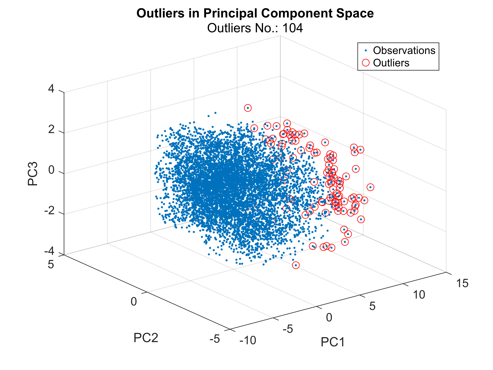

Tabulate the outliers, and display the results.

```matlab
outliersTT.robustcovOutlier = robustcovOutlierIdx;
```

##  DBSCAN method

[DBSCAN](matlab: doc dbscan) (Density\-based spatial clustering of applications with noise) is a density\-based clustering algorithm. DBSCAN is frequently used  to analyze and segment point clouds, effectively identifying clusters of points within a 3D space based on their density, making it particularly useful for tasks like object detection and surface segmentation in applications like autonomous driving and 3D reconstruction where point cloud data is prevalent. Doc example about point clouds [https://uk.mathworks.com/help/vision/point\-cloud\-processing.html](https://uk.mathworks.com/help/vision/point-cloud-processing.html)


The algorithm identifies three kinds of points: core points, border points, and noise points (i.e., outliers). 

-  Core points in a cluster are points that have at least a minimum number of neighbors ([`minpts`](https://uk.mathworks.com/help/releases/R2025a/stats/dbscan.html?searchPort=56176#mw_8f71b08a-185b-49d9-b224-3733d73ca4bd)) in their epsilon neighborhood ([`epsilon`](https://uk.mathworks.com/help/releases/R2025a/stats/dbscan.html?searchPort=56176#mw_8e9da8d6-2310-43e6-83ba-848b3f135fb7)). Each cluster must contain at least one core point. 
-  Border points in a cluster are points that have fewer than the required minimum number of neighbors for a core point ([`minpts`](https://uk.mathworks.com/help/releases/R2025a/stats/dbscan.html?searchPort=56176#mw_8f71b08a-185b-49d9-b224-3733d73ca4bd)) in their epsilon neighborhood ([`epsilon`](https://uk.mathworks.com/help/releases/R2025a/stats/dbscan.html?searchPort=56176#mw_8e9da8d6-2310-43e6-83ba-848b3f135fb7)). 
-  Noise points are outliers that do not belong to any cluster. 

&nbsp;&nbsp;&nbsp;&nbsp;&nbsp;&nbsp;&nbsp;&nbsp;&nbsp;&nbsp;&nbsp;&nbsp;&nbsp;&nbsp;&nbsp;&nbsp;&nbsp;&nbsp;&nbsp;&nbsp;&nbsp;&nbsp;&nbsp;&nbsp;&nbsp;&nbsp;&nbsp;&nbsp; 


Empirically minpts can start with number of input features + 1.

```matlab
minpts = numComponents+1;
```

One strategy for estimating a value for `epsilon` is to generate a *k*\-distance graph for the input data `X`. For each point in `X`, find the distance to the *k*th nearest point, and plot sorted points against this distance. 

```matlab
[kD, kDIdx] = pdist2(S(:,1:numComponents),S(:,1:numComponents),"euc","Smallest",minpts);
```

Visualize the distance in descending order. The graph contains a knee. The distance that corresponds to the knee is generally a good choice for `epsilon`, because it is the region where points start tailing off into outlier (noise) territory.

```matlab
sortedKD = sort(kD(end,:));
figure
plot(sortedKD);
title('k-distance graph')
xlabel("Points sorted with "+ minpts + " nearest distances")
ylabel(minpts + " nearest distances")
grid on
hold on
```

Set the knee value as the `epsilon` to this range.

```matlab
epsilon = 0.5;
yline(epsilon, "Color","r","Label","epsilon = "+ epsilon,"LabelHorizontalAlignment","left", "LabelColor","m")
hold off
```


Perform dbscan using the chosen parameters `epsilon` and `minpts`.

```matlab
grpIdx = dbscan(S(:,1:numComponents),epsilon,minpts);
```

The dbscan algorithm returns the cluster indices for all the observations.  An index equal to `–1` indicates an outlier (or noise point).

```matlab
DBSCANOutlierIdx = grpIdx == -1;
```

Visualize in the first three principal components and highlight the outliers.

```matlab
visualizeOutliersinPCA(S, DBSCANOutlierIdx)
```


Tabulate the results and visualize in a stacked plot.

```matlab
outliersTT.DBSCANOutlier = DBSCANOutlierIdx;
```

-  DBSCAN is fast across three or more dimensions and intuitive. However, selecting the optimal parameters can be tricky, and the model needs to be re\-calibrated every time new data needs analysis. 

## Model\-based methods
### Local Outlier Factor

The local outlier factor ([LOF](matlab: doc lof)) algorithm detects outliers based on the *relative density* of an observation with respect to the surrounding neighborhood. Outliers are points that have a substantially lower density than their neighbors. 


The locality is given by  *k* nearest neighbors, whose distance is used to estimate the density. In the following figure, point A has a much lower density than its neighbors. By default, *k* is set as $min(20,n-1)$ , where n is the number of observations.


&nbsp;&nbsp;&nbsp;&nbsp;&nbsp;&nbsp;&nbsp;&nbsp;&nbsp;&nbsp;&nbsp;&nbsp;&nbsp;&nbsp;&nbsp;&nbsp;&nbsp;&nbsp;&nbsp;&nbsp;&nbsp;&nbsp;&nbsp;&nbsp;&nbsp;&nbsp;&nbsp;&nbsp; 


**Unsupervised workflow:** We don't know which observations are anomaly, but we can give an empirical guess of how much percentage (or fraction) of data is anomaly.


For normal observations, the local outlier factor scores are less than or close to 1, indicating that the local reachability density of an observation is higher than or similar to its neighbors. A local outlier factor score is greater than 1 can indicate an anomaly. 

```matlab
[lofMdl,LOFOutlierIdx,lof_scores] = lof(S(:,1:numComponents), ...
    "ContaminationFraction",contaminationFraction);
```

Visualize in the first three principal components and highlight the outliers.

```matlab
visualizeOutliersinPCA(S,LOFOutlierIdx)
```

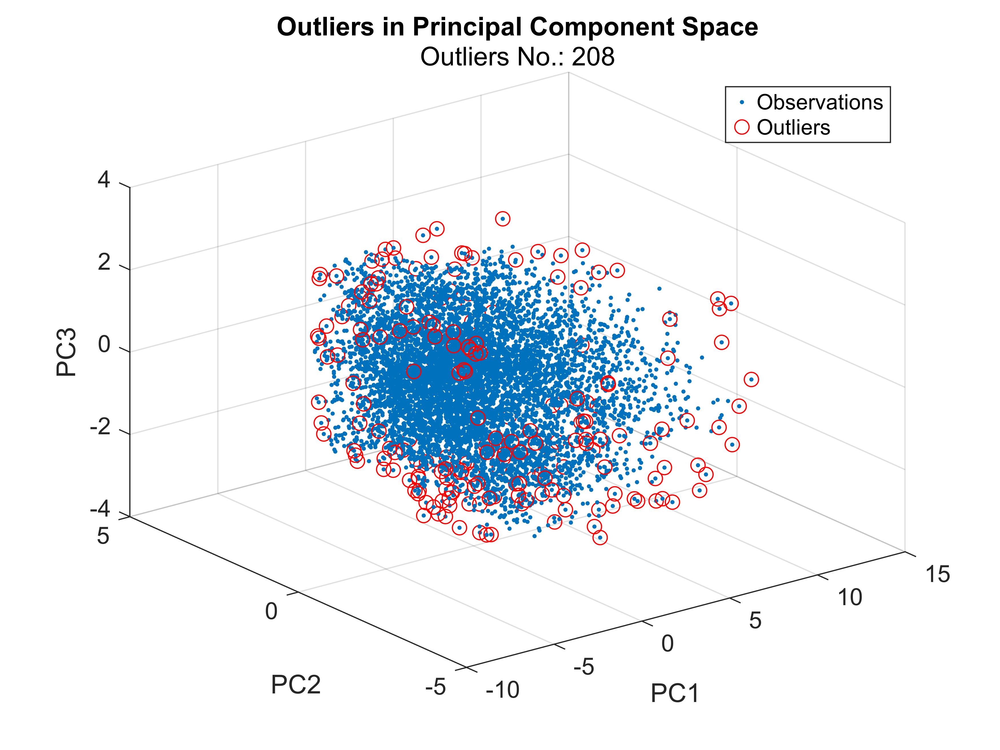

For all model\-based the outlier detection methods, if a new contamination fraction is set, we don't need to retrain the outlier models, only use the already computed scores to find the outliers under the new contamination fraction.

```matlab
newContaminationFraction = 0.05;
newScoreThreshold = quantile(lof_scores,1-newContaminationFraction);
newLOFOutlierIdx = lof_scores > newScoreThreshold;
visualizeOutliersinPCA(S,newLOFOutlierIdx)
```

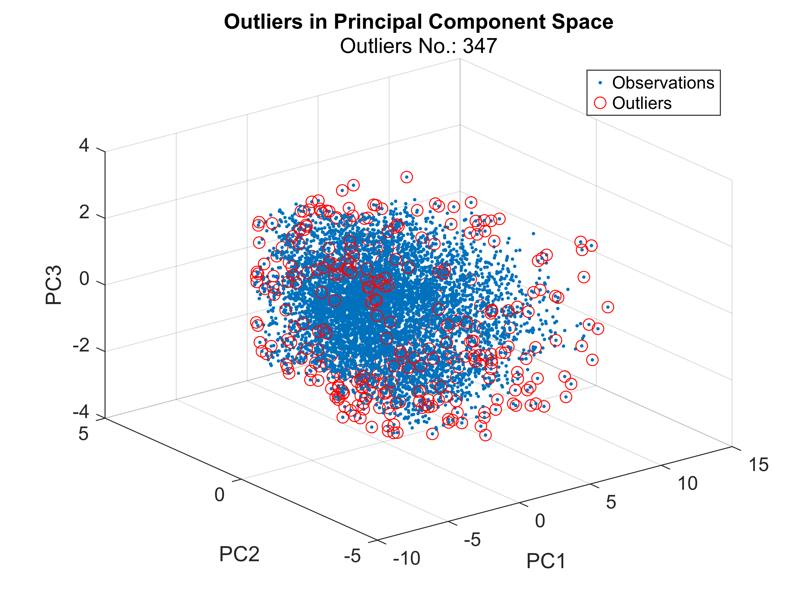

Tabulate the outliers, and display the results.

```matlab
outliersTT.LOFOutlier = LOFOutlierIdx;
```

-  LOF can work with either all continuous or all categorical variables.  
-  LOF can be computationally expensive to run on higher dimension. So scalability is a big issue.  
-  However, compared to DBSCAN, LOF doesn't require neighborhood parameter setting even though it is also a density\-based outlier detection method.  


**Semi\-Supervised workflow for novelty detection**


We train an outlier model on all normal observations and use this model to check unseen data whether it is anomaly or not (`isanomaly`). This workflow also suits to other model\-based outlier detection methods including Local Outlier Factor, Isolation Forest, Robust Random Cut Fores, One\-class SVM.

```
lofNormalMdl = lof(NormalData)%  The ContaminationFraction name-value pair by default is set as 0.
NewDataOutlierTF = isanomaly(lofNormalMdl, NewData)
```
### Isolation Forest

Isolation forest ([`iforest`](matlab: doc iforest)`)` builds an ensemble of "Isolation Trees" for the dataset to detects outliers. Each isolation tree is trained for a subset of training observations, sampled without replacements. The isolation trees then form a tree forest, which is averaged out the results of each tree.


Anomalies are few and different; therefore, an anomaly lands in a separate leaf node closer to the root node and has a shorter path length (the distance from the root node to the leaf node) than normal points.


```matlab
[iforestMdl, iforestOutlierIdx, iforestScores] = iforest(S(:,1:numComponents), ...
    "ContaminationFraction", contaminationFraction);
```

Visualize the data in the first three principal components and highlight the outliers.

```matlab
visualizeOutliersinPCA(S, iforestOutlierIdx)
```


Visualize the scores in histogram.

```matlab
scoreHistogram(iforestScores, iforestMdl.ScoreThreshold, contaminationFraction)
```


Tabulate the outliers, and display the results.

```matlab
outliersTT.IforestOutlier = iforestOutlierIdx;
```

### **Robust Random Cut Forest**

The robust random cut forest algorithm classifies a point as a normal point or an anomaly based on the change in model complexity introduced by the point. Similar to the [Isolation Forest](http://127.0.0.1:62846/static/help/stats/isolationforest.html#mw_12d3da87-2ecb-447f-8901-b3688a7619f9_sep_shared-Definition-IsolationForest) algorithm, the robust random cut forest algorithm builds an ensemble of trees. The two algorithms differ in how they choose a split variable in the trees and how they define anomaly scores.

```matlab
rng("default") % For reproducibility
[rforestMdl,rforestOutlierIdx,rforestScores] = rrcforest(S(:,1:numComponents), ...
    "ContaminationFraction",contaminationFraction,"StandardizeData",true);
```

Visualize the data in the first three principal components and highlight the outliers.

```matlab
visualizeOutliersinPCA(S, rforestOutlierIdx)
```

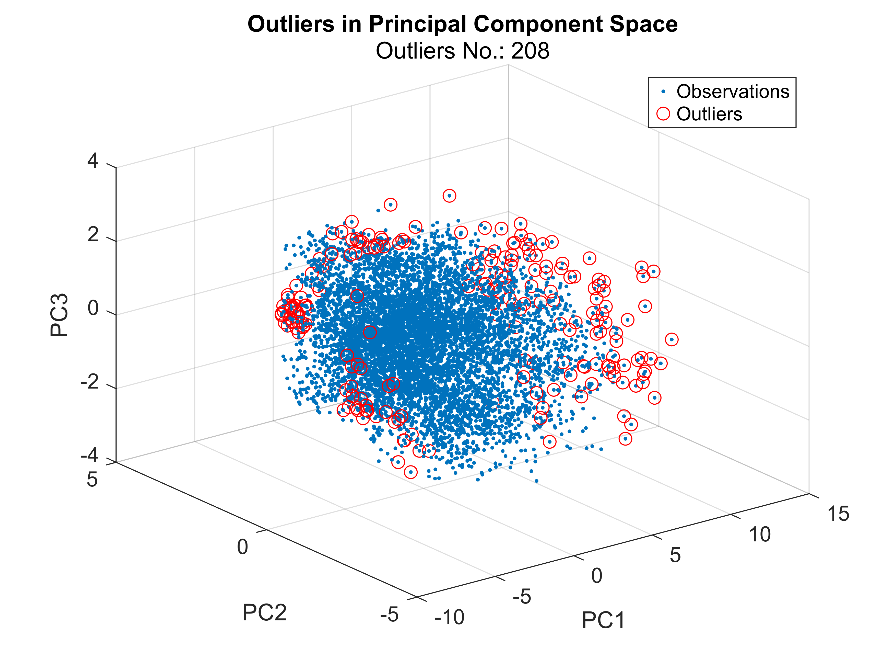

Tabulate the outliers, and display the results.

```matlab
outliersTT.rforestOutlier = rforestOutlierIdx;
```

Visualize the scores in histogram.

```matlab
scoreHistogram(rforestScores, rforestMdl.ScoreThreshold, contaminationFraction)
```


### One\-class SVM

[OCSVM](matlab: doc ocsvm) learns a hyperplane with maximum margin within the a higher\-dimensional feature space to linearly separate data points from origin.


The objective function of one\-class SVM is $minimize_{w,\rho ,\xi } \frac{1}{2}\|w{\|}^2 -\rho +\frac{1}{\nu n}\sum_{i=1}^n \xi_i$ where $w$ is the coefficients of the hyperplane, $\rho$ is the offset from the origin, and $\xi_i$ are the slack variables. They allow for a soft margin but penalize violations $\xi_i$ . A hyperparameter $\nu$ controls the effect of the slack variable i.e., controls the proportion of outliers allowed. Essentially, the objective is to minimize the norm of $w$ while penalizing observations from the margin.


In one\-class SVM, kernel functions are used to measure the similarity between pairs of data in the input space. Common kernel functions include Gaussian, polynomial and sigmoid methods. These kernels map the original input space into a higher\-dimension space, where data points become linearly separable.


Perform One\-class SVM outlier detection.

```matlab
[OCSVMMdl,OCSVMOutlierIdx,OCSVMScores] = ocsvm(S(:,1:numComponents),  ...
    "ContaminationFraction",contaminationFraction, "StandardizeData",true);
```

The score from OCSVM is unbounded (from \-inf to inf). A negative score value with large magnitude indicates a normal observation, and a large positive value indicates an outlier.


Visualize in the first three principal components and highlight the outliers.

```matlab
visualizeOutliersinPCA(S,OCSVMOutlierIdx)
```

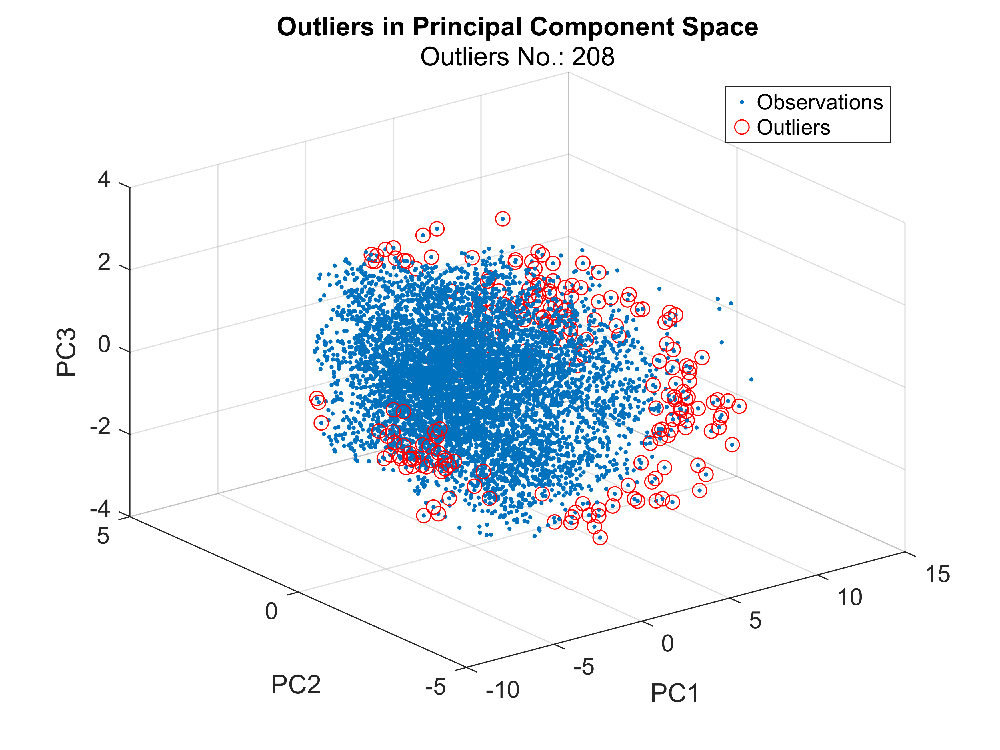

Visualize the scores in histogram.

```matlab
scoreHistogram(OCSVMScores, OCSVMMdl.ScoreThreshold, contaminationFraction)
```


OCSVM can be a bit slow due to the nonlinear kernels. Might not separate the outliers correctly around the margin.


Tabulate the outliers, and display the results.

```matlab
outliersTT.OCSVMOutlier = OCSVMOutlierIdx;
```

### Autoencoder

Autoencoders is a type of neural network which attempt to reconstruct their input at their output layer. Outliers are those data points which have large reconstruction errors. 


Autoencoder network consists of an encoder and a decoder. The encoder maps the input to an efficient representation (i.e. a feature space with less dimension but more informative than input features). The decoder maps this representation back to the original input. 


The encoder maps input vector x to another vector z, where $z=f\left(W^{\left(1\right)} x+b^{\left(1\right)} \right)\;$ 


 $f$ is a activation (or transformation) function, by default is sigmoid function, $W^{(1)}$ is the weight matrix for layer 1, $b^{(1)}$ is the corresponding bias for layer 1.


The decoder maps the encoded representation $z$ back into an estimate of the original input vector, $x$ by $\hat{x} =f\left(W^{\left(2\right)} z+b^{\left(2\right)} \right)$ 


First, we need to transpose the normalized features matrix to features\-by\-samples for autoencoder. 

```matlab
feaTrans = dataNorm';
```

Then use the [trainAutoencoder](matlab: doc trainAutoencoder) to set the hidden layer neuron size and max epochs used to train the autoencoder. 

```matlab
doTrain = false;
if doTrain
    autoenc = trainAutoencoder(feaTrans, "hiddenSize",20,"L2WeightRegularization",0.0002,"SparsityProportion",0.15, ...
        "MaxEpochs", 1000,"ShowProgressWindow", false);
    save(fullfile("Data","autoenc.mat"), "autoenc")
else
    load(fullfile("Data","autoenc.mat"))
end
```

`trainAutoencoder` only provides one hidden layer. You can [train stacked autoencoders](http://127.0.0.1:60369/static/help/deeplearning/ug/train-stacked-autoencoders-for-image-classification.html) or define more complicated deep learning network for the autoencoder, for example, [Time Series Anomaly Detection Using Deep Learning](https://uk.mathworks.com/help/deeplearning/ug/time-series-anomaly-detection-using-deep-learning.html). MATLAB also provides built\-in function [`deepSignalAnomalyDetector`](matlab: doc deepSignalAnomalyDetector) in Signal Processing Toolbox to use either LSTM Autoencoder or convolutional encoder to detect outliers in signals.


View the autoencoder graphic diagram.

```matlab
figure
view(autoenc)
```


Obtain the reconstructed features from the autoencoder model using the `predict` function.

```matlab
feaReconstructed = predict(autoenc,feaTrans);
```

Compute the overall root mean square error and each sample's square root error.

```matlab
mseError = mse(feaTrans,feaReconstructed, "all")
```

```matlabTextOutput
mseError = 0.0048
```

```matlab
E1 = sqrt(sum((feaTrans - feaReconstructed).^2));
```

Find the outliers if their reconstruction errors are at the top (contaminationFraction)% percentile.

```matlab
ETranspose = E1';
figure
bar(ETranspose)
title("Reconstruction Error")
```

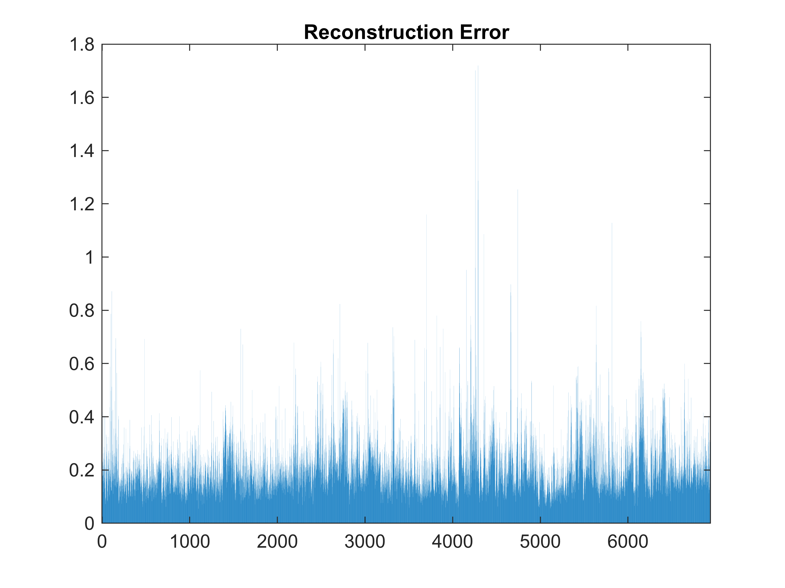

Set the reconstruction threshold for outliers.

```matlab
threshold = quantile(ETranspose,1-contaminationFraction)
```

```matlabTextOutput
threshold = 0.4473
```

```matlab
AutoEncoderOutlierIdx = ETranspose >= threshold;
```

Visualize in the first three principal components and highlight the outliers.

```matlab
visualizeOutliersinPCA(S, AutoEncoderOutlierIdx)
```

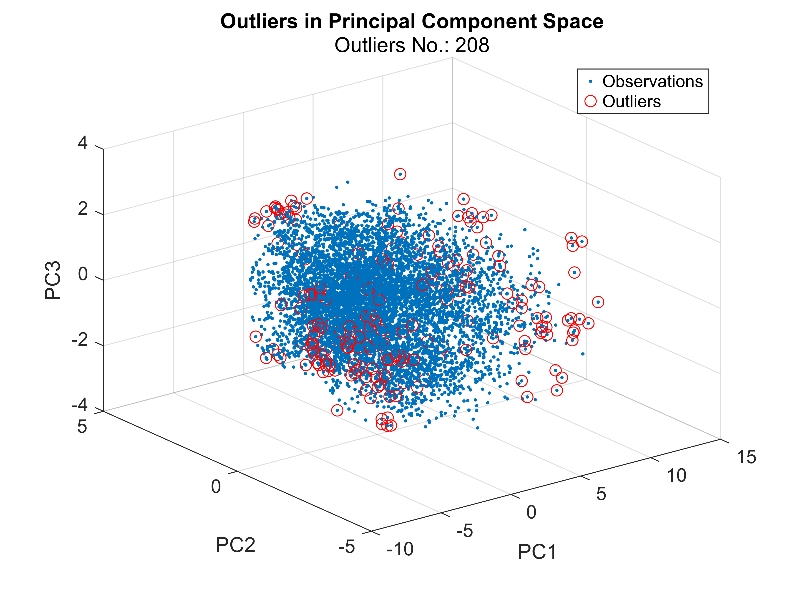

Visualize the scores in histogram.

```matlab
scoreHistogram(ETranspose, threshold, contaminationFraction)
```

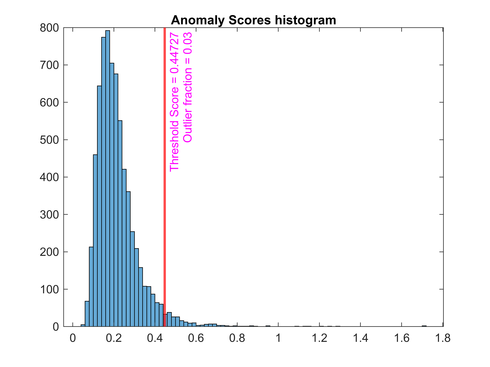

Tabulate the outliers, and display the results.

```matlab
outliersTT.AutoEncoderOutlier = AutoEncoderOutlierIdx;
```

# Combine all the methods

Can use majority vote or other methods like weighted sum can be applied. For example, if you have a small amount of labeled outliers, you can use true positive ratio to weight each method's importance in the final outlier decision.

```matlab
outliersTT.FinalOutlier = mean(outliersTT{:,["T2Outlier","AutoEncoderOutlier","DBSCANOutlier","IforestOutlier","LOFOutlier","OCSVMOutlier","rforestOutlier","robustcovOutlier"]},2) >=0.5;
visualizeOutliersinPCA(S, outliersTT.FinalOutlier )
```


Visualize the final outliers in the important (or interested) features identified by PCA.

```matlab
figure
tiledlayout("flow")
interestedFeatures = [importantFeatures;"PT08.S5(O3)"];
for k = 1: length(interestedFeatures)
    nexttile
    plot(outliersTT.Properties.RowTimes, outliersTT.(interestedFeatures(k)), "Color",[0.5, 0.5, 0.5])
    hold on
    scatter(outliersTT.Properties.RowTimes(outliersTT.FinalOutlier),outliersTT{outliersTT.FinalOutlier,interestedFeatures(k)},  "Marker","x")
    hold off
    legend(["Data", "Outliers"], "Location","best")
    title(interestedFeatures(k))
end
```


**Helper Functions**

```matlab
function visualizeOutliersinPCA(S,outlierIdx)
figure
scatter3(S(:, 1), S(:, 2), S(:, 3), ".")
hold on
scatter3(S(outlierIdx, 1), S(outlierIdx, 2), S(outlierIdx, 3), "ro")
hold off
grid on
xlabel("PC1")
ylabel("PC2")
zlabel("PC3")
legend(["Observations", "Outliers"], "Location","best")
title("Outliers in Principal Component Space")
subtitle("Outliers No.: "+ sum(outlierIdx))
end
function scoreHistogram(scores, scoreThreshold, contaminationFraction)
figure
histogram(scores)
xline(scoreThreshold,"r-",...
join(["Threshold Score =", scoreThreshold; "Outlier fraction =", contaminationFraction]), "LabelColor","m", "LineWidth",2)
title("Anomaly Scores histogram")
end
```
