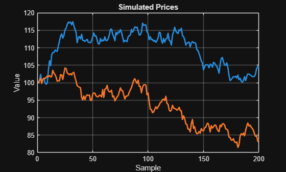
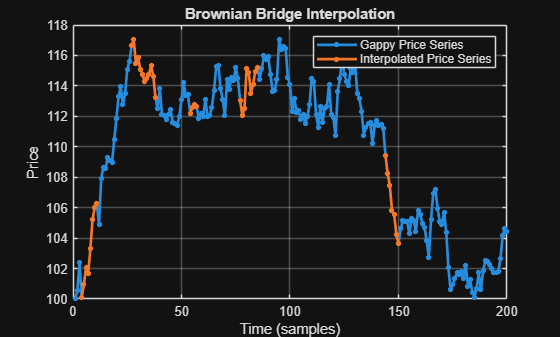

<a id="TMP_4551"></a>

# **Brownian Bridge Interpolation**
<!-- Begin Toc -->

## Table of Contents
&emsp;[Generate correlated random data for two series](#TMP_89ab)
 
&emsp;[Convert returns to prices](#TMP_688a)
 
&emsp;[Insert some gaps in the first series containing NaNs](#TMP_65f3)
 
&emsp;[Estimate GBM model parameters](#TMP_4272)
 
&emsp;[Build the GBM](#TMP_74ca)
 
&emsp;[Create an evenly\-spaced time vector](#TMP_66f9)
 
&emsp;[Find the start and end indices of each bridge](#TMP_99b7)
 
&emsp;[Use the model to interpolate over each gap](#TMP_2097)
 
&emsp;[Inspect the bridges](#TMP_14d9)
 
<!-- End Toc -->
<a id="TMP_89ab"></a>

# Generate correlated random data for two series
```matlab
rng default
rho = [1, 0.2; 0.2, 1];
N = 199;
U = copularnd( "Gaussian", rho, N );
rets = norminv( U );
```
<a id="TMP_688a"></a>

# Convert returns to prices
```matlab
prices = cumsum( [100, 100; rets] ); % Initial value 100, say

figure
plot( prices, "LineWidth", 2 )
xlabel( "Sample" )
ylabel( "Value" )
title( "Simulated Prices" )
grid on
```


<a id="TMP_65f3"></a>

# Insert some gaps in the first series containing NaNs
```matlab
gapIdx = [5:10, 28:37, 55:56, 78:84, 145:149];
gappyPrices = prices;
gappyPrices(gapIdx, 1) = NaN;
gappySeries = gappyPrices(:, 1);
```
<a id="TMP_4272"></a>

# Estimate GBM model parameters
```matlab
retsMu = mean( rets ) / N;
retsSigma = std( rets ) / N;
drift = diag( retsMu );
diffusion = diag( retsSigma );
rho = corr( rets );
```
<a id="TMP_74ca"></a>

# Build the GBM
```matlab
mdl = gbm( drift, diffusion, "Correlation", rho );
```
<a id="TMP_66f9"></a>

# Create an evenly\-spaced time vector
```matlab
T = (1 : N+1).';
```
<a id="TMP_99b7"></a>

# Find the start and end indices of each bridge

Note that Brownian bridge interpolation requires a valid value on either side of the bridge. If the series begins or ends with NaNs then a different method should be used.

```matlab
changes = diff( [false; isnan( gappySeries )] );
bridgeStart = find( changes == 1 ) - 1;
bridgeEnd = find( changes == -1 );
```
<a id="TMP_2097"></a>

# Use the model to interpolate over each gap
```matlab
filledSeries = gappySeries;

for k = 1 : numel( bridgeStart )
    
    % Bridge time vector
    t = bridgeStart(k) : bridgeEnd(k);
    
    % Bridge end points (data)
    X = gappyPrices([bridgeStart(k), bridgeEnd(k)], :); 
    
    % Bridge end points (time)
    XT = T([bridgeStart(k), bridgeEnd(k)]);
    
    % Interpolate
    bridgeValues = interpolate( mdl, t, X, "Times", XT );
    filledSeries(t) = bridgeValues(:, 1);

end % for
```
<a id="TMP_14d9"></a>

# Inspect the bridges
```matlab
c = colororder();
figure
plot( T, gappySeries, ".-", "LineWidth", 2, "MarkerSize", 12 )
hold on
for k = 1 : numel( bridgeStart )
    t = bridgeStart(k) : bridgeEnd(k);
    plot( t, filledSeries(t), ".-", ...
        "LineWidth", 2, ...
        "Color", c(2, :), ...
        "MarkerSize", 12 )
end
xlabel( "Time (samples)" )
ylabel( "Price" )
title( "Brownian Bridge Interpolation" )
grid on
legend( "Gappy Price Series", "Interpolated Price Series" )
```


