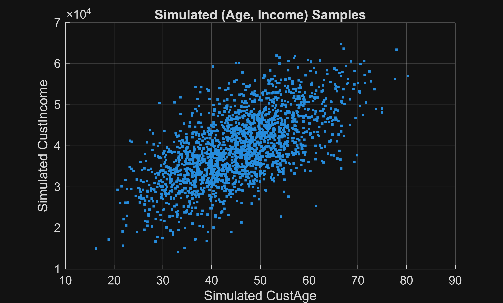

<a id="TMP_1f6b"></a>

# **Techniques for Handling Missing Data**

In this script we provide an overview of some techniques for handling missing values in a data set.

<!-- Begin Toc -->

## Table of Contents
&emsp;[Context and motivation.](#TMP_6d5a)
 
&emsp;&emsp;[Why is it important to handle missing data?](#TMP_17f0)
 
&emsp;&emsp;[When can these techniques be used?](#TMP_68f4)
 
&emsp;&emsp;[When should these techniques not be used?](#TMP_815a)
 
&emsp;&emsp;[Example data](#TMP_6298)
 
&emsp;[Load the credit card data set.](#TMP_8002)
 
&emsp;[Visualize the missing data pattern.](#TMP_0dc5)
 
&emsp;[Investigate the missing data pattern.](#TMP_2d2b)
 
&emsp;[Rowwise deletion.](#TMP_985a)
 
&emsp;[Impute missing data using $k$ \-nearest neighbors.](#TMP_92fb)
 
&emsp;[Compare the imputed data with the original data.](#TMP_7dfe)
 
&emsp;[Model\-based imputation.](#TMP_87f6)
 
&emsp;[Alternating least squares.](#TMP_716d)
 
&emsp;[Time\-series methods: Brownian bridges.](#TMP_7f03)
 
&emsp;[Data synthesization.](#TMP_7271)
 
&emsp;&emsp;[Copulas](#TMP_2ff5)
 
&emsp;&emsp;[Generalized adversarial networks (GANs)](#TMP_1332)
 
<!-- End Toc -->
<a id="TMP_6d5a"></a>

# Context and motivation.
<a id="TMP_17f0"></a>

## Why is it important to handle missing data?
-  The presence of missing values could affect the validity of the test, model, or inference. 
-  Deleting too many rows with missing values reduces the sample size and therefore the power of any test or model. It may also bias the results. 
-  Data may not be missing completely at random. Subgroups within the population may be inadvertently excluded or underrepresented if they are systematically missing data 
-  Removing outliers could lead to missing values in the data. 
<a id="TMP_68f4"></a>

## When can these techniques be used?

Some techniques are more appropriate for tabular data (e.g., kNN or random forest imputation). Others are applicable to time series (e.g., Brownian bridges). Some techniques are distance\-based, and so might need to be applied to a purely numeric data set. For distance\-based algorithms, standardizing the variables will likely be needed to avoid inadvertant bias. Other techniques can cope with categorical variables, or a mixed dataset comprising both continuous and categorical variables.

<a id="TMP_815a"></a>

## When should these techniques not be used?

If we have a large dataset with good coverage across all subgroups, then it will be easier and simpler to delete rows with missing data.

<a id="TMP_6298"></a>

## Example data

In this script we work with the credit card dataset that ships with the Financial Toolbox (Refaat 2011). 


The dataset comprises a set of continuous and categorical variables for a collection of credit cards. The data is labelled, and the final column (`status`) indicates whether the loan payments are in default. 


Each row of the table holds the data for one credit card, and each column of the table is a feature or variable.

<a id="TMP_8002"></a>

# Load the credit card data set.
```matlab
load( "CreditCardData.mat" )
```

Prepare the sample data set containing missing values.

```matlab
dataMissing.Properties.RowNames = string( dataMissing.CustID );
dataMissing.CustID = [];
dataMissing.status = categorical( dataMissing.status, [0, 1], ["NonDefault", "Default"] );
```

Summarize the variables.

```matlab
head( dataMissing )
```

```matlabTextOutput
         CustAge    TmAtAddress     ResStatus     EmpStatus    CustIncome    TmWBank    OtherCC    AMBalance    UtilRate      status  
         _______    ___________    ___________    _________    __________    _______    _______    _________    ________    __________

    1       53          62         <undefined>    Unknown        50000         55         Yes       1055.9        0.22      NonDefault
    2       61          22         Home Owner     Employed       52000         25         Yes       1161.6        0.24      NonDefault
    3       47          30         Tenant         Employed       37000         61         No        877.23        0.29      NonDefault
    4      NaN          75         Home Owner     Employed       53000         20         Yes       157.37        0.08      NonDefault
    5       68          56         Home Owner     Employed       53000         14         Yes       561.84        0.11      NonDefault
    6       65          13         Home Owner     Employed       48000         59         Yes       968.18        0.15      NonDefault
    7       34          32         Home Owner     Unknown        32000         26         Yes       717.82        0.02      Default   
    8       50          57         Other          Employed       51000         33         No        3041.2        0.13      NonDefault
```

```matlab
summary( dataMissing )
```

```matlabTextOutput
dataMissing: 1200x10 table

Description: Credit card dataset, from: M. Refaat, Credit Risk Scorecards, lulu.com, 2011.

Variables:

    CustAge: double
    TmAtAddress: double
    ResStatus: categorical (3 categories)
    EmpStatus: categorical (2 categories)
    CustIncome: double
    TmWBank: double
    OtherCC: categorical (2 categories)
    AMBalance: double
    UtilRate: double
    status: categorical (2 categories)

Statistics for applicable variables:

                   NumMissing       Min           Median          Max             Mean              Std      

    CustAge            30              21              45            74           45.1094            9.8076  
    TmAtAddress         0               2              36           207           41.9308           29.9028  
    ResStatus          40                                                                                    
    EmpStatus           0                                                                                    
    CustIncome          0           18000           39000         62000        3.9318e+04        8.2689e+03  
    TmWBank             0               2              28           128           34.2433           25.1895  
    OtherCC             0                                                                                    
    AMBalance           0          0.2100        711.6850          3812          803.1115          587.5873  
    UtilRate            0               0          0.1300        1.9700            0.2206            0.2582  
    status              0                                                                                    
```

If we have nonstandard indicators for missing values in the dataset, first use [`standardizeMissing`](matlab: doc standardizeMissing) to obtain a standard set of missing values for each type (i.e., `NaN` for continuous variables and `<undefined>` for categorical variables).

<a id="TMP_0dc5"></a>

# Visualize the missing data pattern.
```matlab
tf = ismissing( dataMissing );

figure
imagesc( tf )
xticks( 1 : width( dataMissing ) )
xticklabels( dataMissing.Properties.VariableNames )
ylabel( "Customer ID" )
title( "Missing Data Distribution" )
```


<a id="TMP_2d2b"></a>

# Investigate the missing data pattern.

For any exploratory data analysis or model\-building, it's good practice to investigate whether there are underlying trends or patterns in the missing data. This helps to understand and avoid bias in subsequent models. For example, it could be the case that certain subgroups in the data are more likely to exhibit missing values.


Let's start with `CustAge`.

```matlab
CustAgeMissing = ismissing( dataMissing.CustAge );
contVars = dataMissing(:, vartype( "numeric" ));
contVars.CustAge = [];
catVars = dataMissing(:, vartype( "categorical" ));
```

Use a two\-sample t\-test ([`ttest2`](matlab: doc ttest2)) to determine whether there is any significant difference between the missing and nonmissing subgroups across each of the continuous variables.

```matlab
for k = width( contVars ) : -1 : 1
    contpCustAge(k) = ttest2( CustAgeMissing, contVars{:, k} );    
end % for

disp( "Continuous variables with significant differences between missing and nonmissing CustAge subgroups:" )
```

```matlabTextOutput
Continuous variables with significant differences between missing and nonmissing CustAge subgroups:
```

```matlab
disp( contpCustAge < 0.05 )
```

```matlabTextOutput
   0   0   0   0   0
```

Use a similar procedure via [`crosstab`](matlab: doc crosstab) to investigate the categorical variables.

```matlab
for k = width( catVars ) : -1 : 1
    [~, ~, catpCustAge(k)] = crosstab( CustAgeMissing, catVars{:, k} );
end

disp( "Categorical variables with significant differences between missing and nonmissing CustAge subgroups:")
```

```matlabTextOutput
Categorical variables with significant differences between missing and nonmissing CustAge subgroups:
```

```matlab
disp( catpCustAge < 0.05 )
```

```matlabTextOutput
   0   0   0   0
```

Repeat the process for `ResStatus`.

```matlab
ResStatusMissing = ismissing( dataMissing.ResStatus );
contVars = dataMissing(:, vartype( "numeric" ));
catVars = dataMissing(:, vartype( "categorical" ));
catVars.ResStatus = [];

for k = width( contVars ) : -1 : 1
    contpResStatus(k) = ttest2( CustAgeMissing, contVars{:, k} );     
end % for
disp( "Continuous variables with significant differences between missing and nonmissing ResStatus subgroups:" )
```

```matlabTextOutput
Continuous variables with significant differences between missing and nonmissing ResStatus subgroups:
```

```matlab
disp( contpResStatus < 0.05 )
```

```matlabTextOutput
   0   0   0   0   0   0
```

```matlab
for k = width( catVars ) : -1 : 1
    [~, ~, catpResStatus(k)] = crosstab( CustAgeMissing, catVars{:, k} );
end
disp( "Categorical variables with significant differences between missing and nonmissing ResStatus subgroups:")
```

```matlabTextOutput
Categorical variables with significant differences between missing and nonmissing ResStatus subgroups:
```

```matlab
disp( catpResStatus < 0.05 )
```

```matlabTextOutput
   0   0   0
```

Cross\-tabulate the missing values for the two variables.

```matlab
[~, ~, pmiss] = crosstab( CustAgeMissing, ResStatusMissing );
disp( "Significant dependence between the missing values in CustAge and ResStatus:" )
```

```matlabTextOutput
Significant dependence between the missing values in CustAge and ResStatus:
```

```matlab
disp( pmiss < 0.05 )
```

```matlabTextOutput
   0
```

In this example, we can conclude that the data is missing completely at random (MCAR) \- the probability of any observation being missing is uniform.


For other data sets, we might conclude that the data is:

-  missing at random (MAR): the probability of being missing is uniform after controlling for group membership in the observed data. 
-  missing not at random (MNAR): the missing data pattern is neither MCAR nor MAR. 
<a id="TMP_985a"></a>

# Rowwise deletion.

By far the most common method of handling missing data is to simply remove it. To preserve the tabular structure of the dataset, this means removing all the rows that contain at least one missing value. 


This method is simple and quick to implement, and could work well for large datasets with good coverage of different subgroups.


On the other hand, it has the potential to throw away valid data, and can introduce bias if the data is MNAR. It also reduces the power of subsequent tests or models, by reducing the effective sample size.


See [`rmmissing`](matlab: doc rmmissing).

<a id="TMP_92fb"></a>

# Impute missing data using $k$ \-nearest neighbors.

A powerful method for imputing missing values is to use the $k$ \-nearest neighbors (kNN) algorithm. The idea is that for a given row containing a missing value, we find the $k$ closest observations to the given row. If the missing value is categorical, then we use the majority vote from the corresponding categories in the nearest neighbors. If the missing value is continuous, we use the mean of the corresponding values in the nearest neighbors. In this example we use [`fitcknn`](matlab: doc fitcknn), which as a classifier, is designed to predict categorical values. See also [`knnimpute`](matlab: doc knnimpute).


The kNN algorithm depends on the choice of a distance metric between observations (rows) in the dataset.


We have both continuous and categorical variables in the dataset, so let's first convert the categorical variables to numeric variables.

```matlab
custAgeToImpute = dataMissing;
custAgeToImpute = convertvars( custAgeToImpute, @iscategorical, @double );
```

Fit the kNN model.

```matlab
k = 15;
[custAgeToImputeZ, mu, sigma] = normalize( custAgeToImpute{:, :}, "zscore" );
imputedZ = knnimpute( custAgeToImputeZ.', k, "Distance", "euclidean" ).';
custAgeImputedKNN = sigma .* imputedZ + mu;

imputedCustAgeKNN = custAgeToImpute.CustAge;
tf = ismissing( imputedCustAgeKNN );
imputedCustAgeKNN(tf) = custAgeImputedKNN(tf, 1);
```

Repeat the process for `ResStatus`.

```matlab
resStatusToImpute = dataMissing;
resStatusToImpute = convertvars( resStatusToImpute, ["EmpStatus", "OtherCC", "status"], @double );
knnModelResStatus = fitcknn( resStatusToImpute, "ResStatus", ...
    "NumNeighbors", k, ...
    "Standardize", true, ...
    "Distance", "euclidean" );

imputedResStatusKNN = resStatusToImpute.ResStatus;
tf = ismissing( imputedResStatusKNN );
imputedResStatusKNN(tf) = predict( knnModelResStatus, resStatusToImpute(tf, :) );
```

Combine the results into one table.

```matlab
imputedDataKNN = dataMissing;
imputedDataKNN(:, ["CustAge", "ResStatus"]) = table( imputedCustAgeKNN, imputedResStatusKNN );
```
<a id="TMP_7dfe"></a>

# Compare the imputed data with the original data.
```matlab
figure
tiledlayout( "horizontal" )

nexttile
histogram( dataMissing.CustAge )
hold on
histogram( imputedDataKNN.CustAge )
xlabel( "CustAge" )
ylabel( "Count" )
title( "CustAge Histogram" )
grid on
legend( "Original", "Imputed" )

nexttile
qqplot( dataMissing.CustAge, imputedDataKNN.CustAge )
xlabel( "Original Quantiles" )
ylabel( "Imputed Quantiles" )
title( "CustAge QQ-Plot" )
grid on

nexttile
[origF, origx] = ecdf( dataMissing.CustAge );
[impF, impx] = ecdf( imputedDataKNN.CustAge );
plot( origx, origF, "LineWidth", 2 )
hold on
plot( impx, impF, "LineWidth", 2 )
xlabel( "CustAge" )
ylabel( "Cumulative Probability" )
title( "CustAge ECDF" )
grid on
legend( "Original", "Imputed" )
```


Perform a hypothesis test:

```matlab
h = kstest2( dataMissing.CustAge, imputedDataKNN.CustAge );
disp( "Test decision (reject the null that the two distributions are the same): " + h )
```

```matlabTextOutput
Test decision (reject the null that the two distributions are the same): false
```

Compare the original and imputed residential status.

```matlab
figure
histogram( dataMissing.ResStatus )
hold on
histogram( imputedDataKNN.ResStatus )
xlabel( "ResStatus" )
ylabel( "Count" )
title( "ResStatus Histogram" )
grid on
legend( "Original", "Imputed" )
```


<a id="TMP_87f6"></a>

# Model\-based imputation.

Let's now look at other model\-based techniques for imputation. A simple case is using a constant value, such as a descriptive statistic, to fill in the missing values in a variable.

```matlab
meanAge = mean( dataMissing.CustAge, "omitmissing" );
filledAge = fillmissing( dataMissing.CustAge, "constant", meanAge );
```

This technique is simple and preserves the mean.


For a categorical variable the analogous method is to use the most frequent value.

```matlab
modeResStatus = mode( dataMissing.ResStatus );
filledResStatus = fillmissing( dataMissing.ResStatus, "constant", modeResStatus );
```

This approach can be extended to a predictive model that uses the information from the nonmissing values to provide a more accurate prediction of the missing value. Common models include linear regression (using [`fitlm`](matlab: doc fitlm)) and random forests (using [`fitrensemble`](matlab: doc fitrensemble) and [`fitcensemble`](matlab: doc fitcensemble)).


Let's look at the random forest approach. We first create a weak learner (a single tree) to use as the basis of the random forest. Since multiple predictors may contain missing values, it's a good idea to specify the `Surrogate` option as `"on"`. This means that if the top\-level decision variable in the tree has a missing value, a substitute (surrogate) variable will be used instead.

```matlab
rng( "default" )
weakLearner = templateTree( "Surrogate", "on", "Reproducible", true );
```

Create a random forest to predict `CustAge`.

```matlab
custAgeForest = fitrensemble( dataMissing, "CustAge", ...
    "Method", "bag", ...
    "NumLearningCycles", 100, ...
    "Learners", weakLearner );

imputedCustAgeForest = dataMissing.CustAge;
tf = ismissing( imputedCustAgeForest );
imputedCustAgeForest(tf) = predict( custAgeForest, dataMissing(tf, :) );
```

Do the same for `ResStatus`.

```matlab
resStatusForest = fitcensemble( dataMissing, "ResStatus", ...
    "Method", "bag", ...
    "NumLearningCycles", 100, ...
    "Learners", weakLearner );

imputedResStatusForest = dataMissing.ResStatus;
tf = ismissing( imputedResStatusForest );
imputedResStatusForest(tf) = predict( resStatusForest, dataMissing(tf, :) );
```

Combine the results into one table.

```matlab
imputedDataForest = dataMissing;
imputedDataForest(:, ["CustAge", "ResStatus"]) = table( imputedCustAgeForest, imputedResStatusForest );
```

Notes:

-  In contrast to `fitcknn`, the predicted values for `CustAge` from the random forest are not necessarily integers. These values could be rounded if necessary. 
-  It might be desirable to add suitable noise to the imputed values. If a linear regression model is used to impute the missing values, then the imputed values would lie exactly on the regression surface. 
<a id="TMP_716d"></a>

# Alternating least squares.

Alternating least squares(ALS) is a matrix factorization technique that can be used to estimate missing values in a numeric matrix. One specific application of ALS is developing a recommendation system connecting users and items.


The starting point is a large matrix $R$ containing the users (rows) and items (columns). The elements of the matrix $R_{ij}$ represent the rating, or score, assigned by user $i$ to item $j$ . The matrix $R$ is highly sparse because a given user has only rated a small number of items. Due to the high level of sparsity, traditional clustering algorithms such as $k$ \-means are not suitable for predicting the missing ratings.


The objective is to factorize $R$ into a product $UV$ , where $U$ is a $n_U$ \-by\- $k$ matrix and $V$ is a $k$ \-by\- $n_I$ matrix, where $n_U$ is the number of users and $n_I$ is the number of items. The assumption is that the users' preferences can be expressed in terms of a smaller number, $k$ , of hidden or latent factors. For example, if $k=1$ then the items are essentially ranked by overall popularity. 


This can be expressed as an optimization problem: minimize $||R-UV||_F$ , where $||\cdot ||_F$ is the Frobenius norm. To prevent overfitting and ill\-conditioning, it makes sense to constrain the magnitude of the entries of $U$ and $V$ . This can be achieved by including a regularization term in the optimization objective:

 $$ ||R-UV||_F +\lambda (||U||_F +||V||_F ) $$ 

This objective function is not convex, but when $U$ (or $V$ ) is fixed and the problem is solved for $V$ (or $U$ ), then the problem becomes convex (and a least\-squares problem). If we alternate between solving for $U$ and $V$ , then we can obtain convergence.


See [`pca`](matlab: doc pca) and [`nnmf`](matlab: doc nnmf).

```matlab
alsData = dataMissing;
alsData = convertvars( alsData, @iscategorical, @double );
[V, S, ~, ~, ~, mu] = pca( alsData{:, :}, "Algorithm", "als" );
```

Reconstruct the data.

```matlab
reconstructedData = mu + S * V.';
filledDataALS = dataMissing;
tf = ismissing( dataMissing.CustAge );
filledDataALS.CustAge(tf) = reconstructedData(tf, 1);
tf = ismissing( dataMissing.ResStatus );
filledDataALS.ResStatus(tf) = categorical( round( reconstructedData(tf, 3) ), 1:3, ["Home Owner", "Tenant", "Other"] );
```
<a id="TMP_7f03"></a>

# Time\-series methods: Brownian bridges.

See [`Seminar03_BrownianBridgeExamples`](matlab: edit("Seminar03_BrownianBridgeExamples")).

<a id="TMP_7271"></a>

# Data synthesization.

We'll look at two methods for synthesizing data. Data synthesization could be useful in situations such as model exploration or training, and for faster generation compared to running a large Simulink model. We might also need to have a reproducible, nonsensitive dataset for sharing with external colleagues.


It's straightforward to generate simulated random values from a univariate distribution (see [`fitdist`](matlab: doc fitdist), [`makedist`](matlab: doc makedist), and [`random`](matlab: doc random)), but things are less straightforward when correlated samples are required.

<a id="TMP_2ff5"></a>

## Copulas

With this approach, we model the joint distribution of multiple continuous variables. The resulting distribution can then be used to simulate random values which have the same distributional properties as the original data.


As an example, let's model `CustAge` and `CustIncome`.

```matlab
figure
scatter( data.CustAge, data.CustIncome, "." )
xlabel( "CustAge" )
ylabel( "CustIncome" )
title( "Income vs. Age" )
grid on
```


First, we need to fit the marginal distributions for age and income.

```matlab
ageFit = fitdist( data.CustAge, "Kernel" );
incomeFit = fitdist( data.CustIncome, "Kernel" );
```

Transform the data to the unit square $U=[0,1]\times [0,1]$ .

```matlab
U(:, 1) = cdf( ageFit, data.CustAge );
U(:, 2) = cdf( incomeFit, data.CustIncome );
```

Fit a $t$ \-copula.

```matlab
[rho, DoF] = copulafit( "t", U );
```

Use the copula to generate random samples.

```matlab
simU = copularnd( "t", rho, DoF, 2000 );
```

Back\-transform the simulated values into CustAge/CustIncome space.

```matlab
simAgeIncome(:, 1) = icdf( ageFit, simU(:, 1) );
simAgeIncome(:, 2) = icdf( incomeFit, simU(:, 2) );
```

Inspect the simulated values.

```matlab
figure
scatter( simAgeIncome(:, 1), simAgeIncome(:, 2), "." )
xlabel( "Simulated CustAge" )
ylabel( "Simulated CustIncome" )
title( "Simulated (Age, Income) Samples" )
grid on
```



<a id="TMP_1332"></a>

## Generalized adversarial networks (GANs)

See [Generate Synthetic Signals Using Conditional GAN](https://www.mathworks.com/help/deeplearning/ug/generate-synthetic-pump-signals-using-conditional-generative-adversarial-network.html) for an example.

